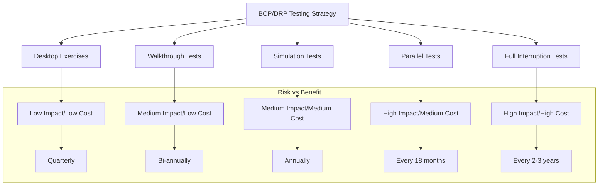
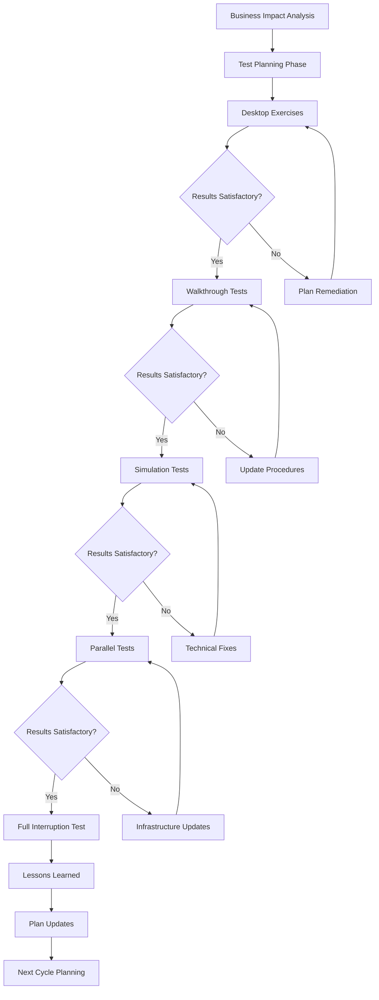
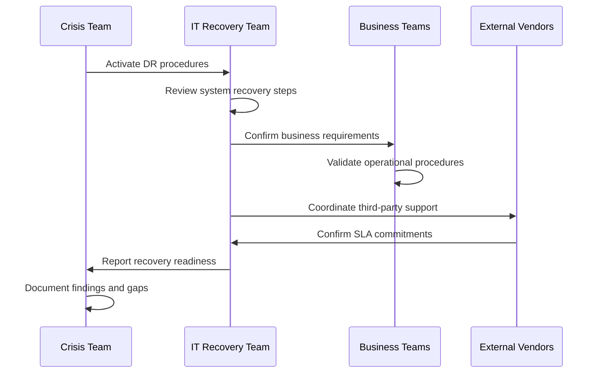
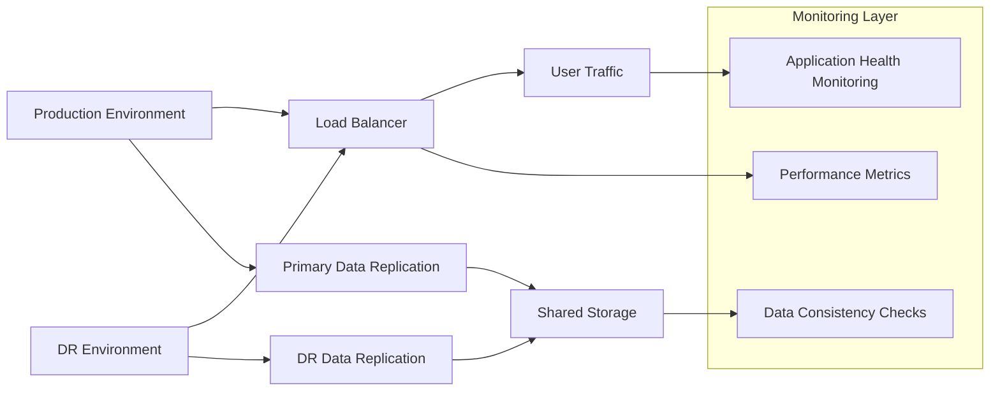
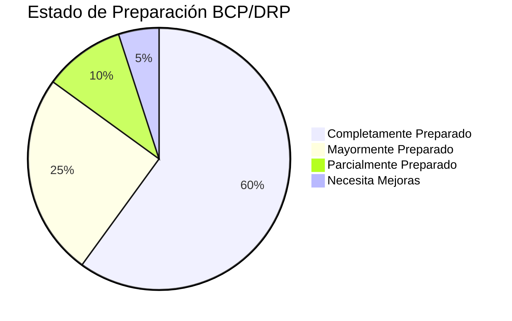
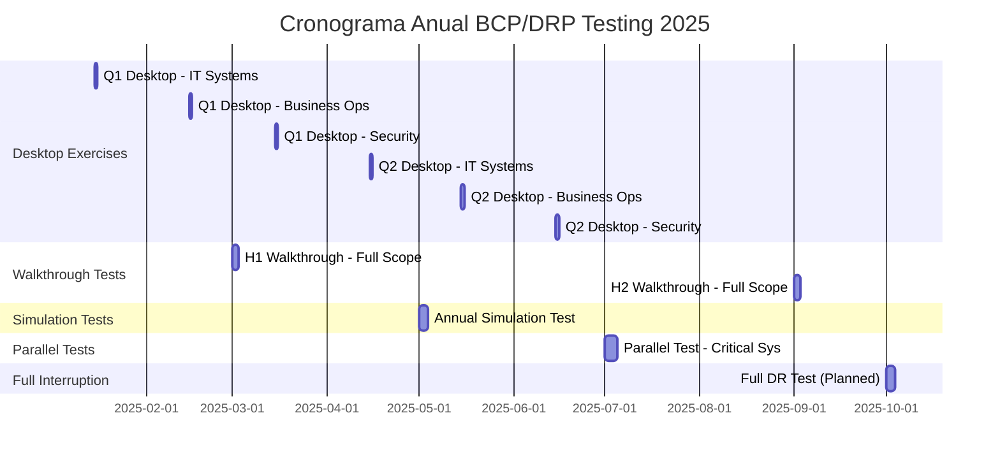
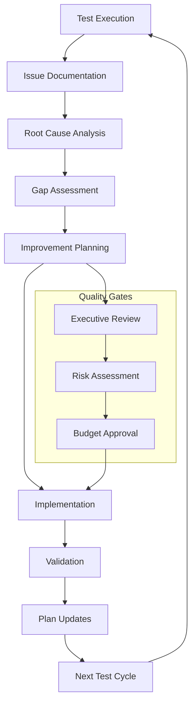
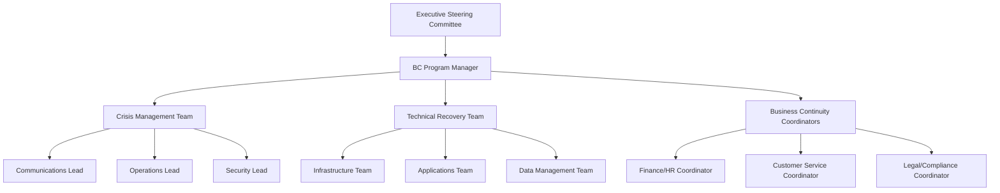

<Callout title="Quieres aprender más?">
  Descarga el [Kit de Ciberseguridad](https://divisioncero.com/home/kit-inicio-ciberseguridad).
</Callout>

## 📋 Información General

**Documento:** Estrategia de Pruebas de BCP/DRP  
**Versión:** 1.0.0  
**Fecha:** Enero 2025  
**Clasificación:** Confidencial  
**Propietario:** CISO - Oficina de Seguridad de la Información  

## 🎯 Objetivo y Alcance

### Objetivo
Establecer una metodología estructurada y sistemática para la validación, prueba y mejora continua de los planes de Continuidad de Negocio (BCP) y Recuperación ante Desastres (DRP) de DivisionCero, garantizando la efectividad operacional y la preparación ante incidentes críticos.

### Alcance
Esta estrategia cubre:
- **Planes de Continuidad de Negocio (BCP)**: Procesos críticos de negocio y operaciones esenciales
- **Planes de Recuperación ante Desastres (DRP)**: Infraestructura TI, centros de datos, servicios cloud
- **Pruebas de Sistemas**: Aplicaciones críticas, bases de datos, comunicaciones
- **Evaluación de Personal**: Equipos de respuesta, roles de crisis, competencias
- **Validación de Proveedores**: Servicios críticos externos, SLAs de recuperación
- **Cumplimiento Regulatorio**: Requisitos normativos y certificaciones

## 🏛️ Marco Normativo

### Referencias Regulatorias
- **ISO 22301:2019** - Security and Resilience - Business Continuity Management
- **ISO/IEC 27031:2011** - Information Technology - Security Techniques - Guidelines for ICT Readiness for Business Continuity
- **NIST SP 800-34** - Contingency Planning Guide for Federal Information Systems
- **ISO 22313:2020** - Security and Resilience - Business Continuity Management Systems - Guidance on the Use of ISO 22301
- **COSO ERM Framework** - Enterprise Risk Management

### Estándares Técnicos
- **ITIL 4** - Service Continuity Management
- **COBIT 2019** - Governance of Enterprise IT
- **TOGAF** - Architecture Framework for Business Continuity
- **FAIR** - Factor Analysis of Information Risk

## 📊 Taxonomía de Tipos de Pruebas

### Clasificación por Complejidad y Impacto


### Matriz de Tipos de Prueba

| Tipo de Prueba | Descripción | Duración | Recursos | Impacto Operacional | Frecuencia |
|---------------|-------------|----------|----------|-------------------|------------|
| **Desktop Exercise** | Revisión teórica de procedimientos | 2-4 horas | Equipos clave | Ninguno | Trimestral |
| **Walkthrough Test** | Simulación paso a paso sin ejecución | 4-8 horas | Múltiples equipos | Mínimo | Semestral |
| **Simulation Test** | Ejercicio con sistemas de prueba | 1-2 días | Equipos + Infra test | Bajo | Anual |
| **Parallel Test** | Ejecución simultánea con producción | 2-4 días | Full team + DR site | Medio | 18 meses |
| **Full Interruption** | Corte completo de sistemas principales | 1-3 días | Toda la organización | Alto | 2-3 años |

## 🏗️ Arquitectura de Pruebas

### Modelo de Pruebas Escalonadas


### Infraestructura de Pruebas

#### Entornos de Testing
```yaml
Testing_Environments:
  production_mirror:
    purpose: "Full-scale disaster recovery testing"
    infrastructure:
      - dedicated_dr_site: "Secondary data center"
      - network_connectivity: "Dedicated links + internet backup"
      - compute_resources: "50% of production capacity minimum"
      - storage_replication: "Real-time and near-real-time"
    
  simulation_environment:
    purpose: "Safe testing without production impact"
    infrastructure:
      - virtual_infrastructure: "VMware/Hyper-V clusters"
      - network_simulation: "GNS3/EVE-NG for network topology"
      - data_subsets: "Anonymized production data samples"
      - isolated_networks: "Segmented from production"
  
  desktop_environment:
    purpose: "Documentation and procedure review"
    infrastructure:
      - collaboration_tools: "Teams/Zoom for remote exercises"
      - documentation_platform: "Confluence/SharePoint"
      - simulation_software: "TableTop exercise platforms"
```

## 🔍 Metodología de Pruebas Detallada

### Fase 1: Desktop Exercises (Ejercicios de Mesa)

#### Objetivo y Características
- **Propósito**: Validación conceptual de planes y procedimientos
- **Participantes**: Equipos clave de crisis y continuidad
- **Duración típica**: 2-4 horas
- **Frecuencia**: Trimestral por área crítica

#### Estructura del Ejercicio
```yaml
Desktop_Exercise_Structure:
  preparation_phase:
    duration: "1-2 weeks"
    activities:
      - scenario_development: "Create realistic incident scenarios"
      - participant_briefing: "Share materials and expectations"
      - logistics_setup: "Book facilities and technology"
  
  execution_phase:
    duration: "2-4 hours"
    activities:
      - scenario_presentation: "30 minutes - incident description"
      - initial_response: "60 minutes - immediate actions"
      - escalation_procedures: "60 minutes - crisis management"
      - recovery_planning: "45 minutes - restoration strategy"
      - lessons_learned: "15 minutes - immediate feedback"
  
  follow_up_phase:
    duration: "1 week"
    activities:
      - detailed_assessment: "Gap analysis and findings"
      - action_plan_creation: "Remediation roadmap"
      - documentation_update: "Plan improvements"
```

#### Escenarios Típicos
- **Ciberataque con cifrado de sistemas críticos**
- **Falla masiva de infraestructura cloud**
- **Desastre natural afectando datacenter principal**
- **Pérdida de personal clave durante crisis**
- **Falla de proveedor crítico de servicios**

### Fase 2: Walkthrough Tests (Pruebas de Recorrido)

#### Metodología de Ejecución


#### Elementos de Validación
- **Communication Trees**: Verificar cadenas de notificación
- **Role Definitions**: Confirmar responsabilidades y autoridades
- **Resource Requirements**: Validar disponibilidad de recursos
- **Decision Points**: Ejercitar criterios de escalamiento
- **External Dependencies**: Confirmar coordinación con terceros

### Fase 3: Simulation Tests (Pruebas de Simulación)

#### Componentes Técnicos
```yaml
Simulation_Components:
  infrastructure_simulation:
    network_outage: 
      - primary_datacenter_isolation
      - internet_connectivity_loss
      - internal_network_segmentation_failure
    
    system_failures:
      - database_corruption_scenarios
      - application_server_crashes
      - storage_array_failures
      - backup_system_unavailability
    
    security_incidents:
      - ransomware_encryption_simulation
      - data_breach_response_exercise
      - insider_threat_scenarios
      - supply_chain_attack_response
  
  business_process_simulation:
    critical_operations:
      - customer_service_continuity
      - financial_transaction_processing
      - supply_chain_management
      - regulatory_reporting_capabilities
    
    human_resources:
      - remote_work_activation
      - alternative_workspace_setup
      - essential_personnel_availability
      - skill_cross_training_validation
```

#### Métricas de Evaluación
- **Recovery Time Objective (RTO)**: Tiempo máximo aceptable de interrupción
- **Recovery Point Objective (RPO)**: Pérdida máxima aceptable de datos
- **Mean Time to Recovery (MTTR)**: Tiempo promedio de restauración
- **Business Impact Assessment**: Costo operacional de la interrupción

### Fase 4: Parallel Tests (Pruebas Paralelas)

#### Configuración Técnica


#### Validaciones Críticas
- **Data Synchronization**: Consistencia entre sitios primario y DR
- **Application Performance**: Rendimiento en infraestructura alternativa
- **Network Connectivity**: Throughput y latencia de enlaces DR
- **Failover Mechanisms**: Tiempo de conmutación automática/manual
- **User Experience**: Impacto en usuarios finales durante la prueba

### Fase 5: Full Interruption Tests (Pruebas de Interrupción Completa)

#### Planning y Consideraciones
```yaml
Full_Interruption_Planning:
  pre_execution:
    timeline: "3-6 months preparation"
    requirements:
      - executive_approval: "C-level sign-off required"
      - customer_notification: "Advance notice with alternatives"
      - regulatory_compliance: "Notify relevant authorities if required"
      - vendor_coordination: "Align with critical service providers"
      - insurance_review: "Validate coverage for testing activities"
  
  execution_window:
    timing: "Low-impact periods (weekends/holidays)"
    duration: "24-72 hours maximum"
    rollback_criteria:
      - critical_business_impact: "Revenue loss exceeds threshold"
      - customer_experience_degradation: "SLA breaches beyond acceptable"
      - regulatory_compliance_risk: "Legal or compliance violations"
      - safety_security_concerns: "Human safety or security compromises"
  
  post_execution:
    immediate: "System restoration and validation"
    short_term: "Lessons learned documentation"
    medium_term: "Plan updates and improvements"
    long_term: "Strategic resilience enhancements"
```

## 📈 Métricas y KPIs de Testing

### Indicadores de Eficacia

#### Métricas Técnicas
| Métrica | Objetivo | Método de Medición | Frecuencia |
|---------|----------|-------------------|------------|
| **RTO Achievement** | 100% cumplimiento | Tiempo real vs objetivo | Por prueba |
| **RPO Achievement** | menos de 15 min pérdida datos | Data consistency checks | Por prueba |
| **System Availability** | más de 99.5% durante DR | Monitoring tools | Continuo |
| **Network Performance** | menos de 20% degradación | Bandwidth monitoring | Durante pruebas |
| **Application Response** | menos de 30% incremento latencia | APM tools | Durante pruebas |

#### Métricas Organizacionales
```yaml
Organizational_KPIs:
  preparedness_metrics:
    - staff_participation_rate: "target: >95%"
    - procedure_adherence_score: "target: >90%"
    - communication_effectiveness: "target: >85%"
    - decision_making_speed: "target: <30min for critical decisions"
  
  improvement_metrics:
    - issues_identified_per_test: "trending downward"
    - resolution_time_for_gaps: "target: <30 days"
    - plan_update_frequency: "within 2 weeks post-test"
    - cross_training_coverage: "target: >80% critical roles"
  
  business_continuity_metrics:
    - critical_process_uptime: "target: >99%"
    - customer_impact_minimization: "target: <5% customer complaints"
    - revenue_protection: "target: <2% revenue loss during DR"
    - regulatory_compliance_maintenance: "target: 100%"
```

### Dashboard de Continuidad


## 🛠️ Herramientas y Plataformas de Testing

### Herramientas de Simulación

#### Plataformas Empresariales
```yaml
Enterprise_Platforms:
  tabletop_exercises:
    - "Noggin Emergency Management"
    - "Everbridge Crisis Commander"
    - "AlertMedia Crisis Communication"
    - "Fusion Risk Management"
  
  technical_simulation:
    - "VMware Site Recovery Manager"
    - "Veeam Backup & Replication"
    - "Zerto Disaster Recovery"
    - "AWS Disaster Recovery"
  
  communication_platforms:
    - "Microsoft Teams Crisis Response"
    - "Slack Enterprise Crisis Channels"
    - "Cisco Webex Crisis Communication"
    - "Zoom Emergency Broadcasting"
  
  monitoring_analytics:
    - "Splunk Business Continuity Monitoring"
    - "New Relic Infrastructure Monitoring"
    - "Datadog Disaster Recovery Tracking"
    - "PagerDuty Incident Response"
```

#### Herramientas Open Source
- **Nagios**: Monitoring de infraestructura y servicios
- **Zabbix**: Monitoring y alerting durante pruebas
- **MRTG/Cacti**: Network performance monitoring
- **Pandora FMS**: Comprehensive IT monitoring
- **OpenNMS**: Network and service monitoring

### Automatización de Pruebas

#### Scripts y Automatización
```yaml
Automation_Framework:
  infrastructure_automation:
    - terraform: "Infrastructure as Code for DR environments"
    - ansible: "Configuration management and deployment"
    - puppet: "System configuration automation"
    - chef: "Infrastructure automation and testing"
  
  application_testing:
    - selenium: "Web application functionality testing"
    - postman: "API endpoint validation during DR"
    - jmeter: "Load testing on DR infrastructure"
    - chaos_monkey: "Fault injection and resilience testing"
  
  data_validation:
    - great_expectations: "Data quality validation"
    - custom_scripts: "Database consistency checks"
    - checksums: "File integrity verification"
    - replication_monitoring: "Real-time sync validation"
```

## 📋 Cronograma Anual de Pruebas

### Calendario Master de Testing


### Matriz de Responsabilidades por Período

| Mes | Tipo de Prueba | Responsable Principal | Participantes | Duración |
|-----|---------------|--------------------|---------------|----------|
| **Enero** | Desktop - IT | IT Operations Manager | IT Teams, Security | 4 horas |
| **Febrero** | Desktop - Business | Business Continuity Manager | Department Heads | 4 horas |
| **Marzo** | Walkthrough H1 | Crisis Management Team | All Critical Teams | 2 días |
| **Abril** | Desktop - IT | IT Operations Manager | IT Teams, Security | 4 horas |
| **Mayo** | Simulation Annual | CISO | IT, Security, Business | 3 días |
| **Junio** | Desktop - Security | Security Manager | SOC, IT, Legal | 4 horas |
| **Julio** | Parallel Test | DR Coordinator | Technical Teams | 4 días |
| **Agosto** | Desktop - Business | BC Manager | Business Units | 4 horas |
| **Septiembre** | Walkthrough H2 | Crisis Team | All Stakeholders | 2 días |
| **Octubre** | Full Interruption | Executive Team | Entire Organization | 3 días |
| **Noviembre** | Lessons Learned | BC Manager | All Test Participants | 1 día |
| **Diciembre** | 2026 Planning | CISO + BC Manager | Strategic Teams | 2 días |

## 🔧 Proceso de Gestión de Mejoras

### Ciclo de Mejora Continua


### Categorización de Hallazgos

#### Clasificación de Issues
```yaml
Issue_Classification:
  critical:
    description: "Complete failure of critical process or system"
    response_time: "immediate (24 hours)"
    approval_level: "C-level executive"
    examples:
      - "Primary datacenter cannot be restored"
      - "Critical business process completely fails"
      - "Communication systems totally unavailable"
  
  high:
    description: "Significant degradation impacting business operations"
    response_time: "48-72 hours"
    approval_level: "Department head"
    examples:
      - "RTO exceeded by >50%"
      - "Key personnel unavailable without backup"
      - "Major system performance degradation"
  
  medium:
    description: "Moderate issues requiring process improvements"
    response_time: "1-2 weeks"
    approval_level: "Process owner"
    examples:
      - "Documentation gaps or unclear procedures"
      - "Training needs identified"
      - "Minor system performance issues"
  
  low:
    description: "Minor improvements or optimizations"
    response_time: "next scheduled update"
    approval_level: "Team lead"
    examples:
      - "Process efficiency improvements"
      - "Documentation formatting issues"
      - "Minor communication improvements"
```

### Template de Reporte Post-Prueba

#### Estructura del Informe
```yaml
Post_Test_Report_Structure:
  executive_summary:
    - test_type_and_scope
    - overall_assessment_rating
    - critical_findings_summary
    - recommended_actions_overview
  
  detailed_findings:
    - test_objectives_vs_results
    - performance_metrics_analysis
    - gap_analysis_by_category
    - risk_assessment_updates
  
  improvement_roadmap:
    - immediate_actions_required
    - short_term_improvements_30_days
    - medium_term_enhancements_90_days
    - long_term_strategic_initiatives
  
  appendices:
    - detailed_test_logs
    - participant_feedback_summary
    - technical_performance_data
    - updated_plan_documents
```

## 👥 Roles y Responsabilidades

### Estructura de Governance

#### Comité de Continuidad de Negocio


#### Responsabilidades por Rol
```yaml
Role_Responsibilities:
  executive_sponsor:
    - strategic_oversight: "Approve testing strategy and budget"
    - risk_acceptance: "Sign-off on residual risks"
    - resource_allocation: "Ensure adequate testing resources"
    - stakeholder_communication: "Report to board and regulators"
  
  bc_program_manager:
    - test_planning: "Develop and maintain testing schedules"
    - coordination: "Coordinate cross-functional testing activities"
    - reporting: "Prepare test reports and recommendations"
    - improvement_management: "Track and implement improvements"
  
  crisis_management_team:
    - incident_command: "Lead crisis response during tests"
    - decision_making: "Make critical operational decisions"
    - stakeholder_communication: "Manage internal/external communications"
    - escalation_management: "Escalate issues to appropriate levels"
  
  technical_teams:
    - system_recovery: "Execute technical recovery procedures"
    - performance_monitoring: "Monitor system performance during tests"
    - issue_identification: "Document technical gaps and failures"
    - solution_implementation: "Implement technical improvements"
  
  business_teams:
    - process_validation: "Validate business process continuity"
    - user_acceptance: "Test business application functionality"
    - customer_communication: "Manage customer impact communications"
    - business_impact_assessment: "Evaluate business impact of disruptions"
```

### Competencias y Entrenamiento

#### Programa de Capacitación
- **BC/DR Fundamentals**: Todos los empleados - Annual
- **Crisis Management**: Equipos de liderazgo - Semestral  
- **Technical Recovery**: Equipos técnicos - Trimestral
- **Communication Protocols**: Portavoces designados - Trimestral
- **Regulatory Compliance**: Legal/Compliance teams - Anual

## 📋 Cumplimiento y Auditoría

### Requisitos Regulatorios

#### Evidencia de Cumplimiento
```yaml
Compliance_Evidence:
  iso_22301:
    clause_8_4: "Testing of business continuity procedures"
    evidence: 
      - test_schedules_and_results
      - improvement_action_tracking
      - competency_records
  
  sox_compliance:
    section_404: "Internal controls over financial reporting"
    evidence:
      - financial_system_recovery_tests
      - data_integrity_validation
      - segregation_of_duties_testing
  
  gdpr_requirements:
    article_32: "Security of processing and incident response"
    evidence:
      - data_breach_response_testing
      - privacy_impact_assessments
      - cross_border_transfer_procedures
  
  industry_specific:
    financial_services: "FFIEC IT examination handbook"
    healthcare: "HIPAA security and privacy rules"
    government: "FISMA contingency planning requirements"
```

### Documentación y Registros

#### Retention Requirements
- **Test Plans**: 7 años
- **Test Results**: 7 años  
- **Issue Tracking**: 5 años
- **Training Records**: 3 años
- **Communications**: 3 años

## 🔄 Mejora Continua y Evolución

### Roadmap Estratégico 2025-2027

#### 2025 - Consolidation Year
```yaml
2025_objectives:
  process_maturity:
    - standardize_testing_methodologies
    - implement_automated_testing_tools
    - enhance_communication_protocols
    - improve_cross_functional_coordination
  
  technology_enhancement:
    - cloud_native_dr_capabilities
    - ai_assisted_failure_prediction
    - automated_failover_mechanisms
    - real_time_replication_monitoring
```

#### 2026 - Innovation Year
- **Predictive Analytics**: ML para predecir puntos de falla
- **Zero-Touch Recovery**: Automatización completa de procesos DR
- **Immersive Training**: VR/AR para simulaciones de crisis
- **Continuous Testing**: Testing automatizado integrado en operaciones

#### 2027 - Optimization Year
- **Adaptive Resilience**: Sistemas que se auto-reparan y aprenden
- **Ecosystem Integration**: BC/DR integrado con partners y proveedores
- **Real-Time Optimization**: Ajuste dinámico de planes basado en conditions
- **Predictive Compliance**: Cumplimiento automático y proactivo

### Métricas de Madurez del Programa

| Nivel | Descripción | Características | Target Timeline |
|-------|-------------|----------------|-----------------|
| **1 - Inicial** | Pruebas ad-hoc, reactivas | Documentation básica, tests irregulares | - |
| **2 - Gestionado** | Procesos definidos y documentados | Calendarios establecidos, roles definidos | Q2 2025 |
| **3 - Definido** | Procesos estandarizados y medidos | KPIs established, mejora continua | Q4 2025 |
| **4 - Cuantitativo** | Procesos controlados y predecibles | Métricas avanzadas, optimization | Q2 2026 |
| **5 - Optimizado** | Mejora continua e innovación | Automatización, predictive capabilities | Q4 2027 |

---

## 📚 Referencias y Documentos Relacionados

### Políticas Relacionadas
- [Plan de Continuidad Operacional](plan-continuidad-operacional)
- [Plan de Recuperación de Desastres](plan-recuperacion-desastres)
- [Política de Continuidad de Negocio](politica-continuidad-negocio)
- [Plan de Respuesta a Incidentes](plan-respuesta-incidentes)

### Marcos de Referencia
- **ISO 22301:2019** - Business Continuity Management Systems
- **NIST SP 800-34** - Contingency Planning Guide
- **ISO/IEC 27031** - ICT Readiness for Business Continuity
- **COBIT 2019** - Management and Governance of Enterprise IT

### Herramientas y Recursos
- **DRI Institute** - Business Continuity Planning
- **BCI Good Practice Guidelines** - Business Continuity Institute
- **FAIR Risk Management** - Factor Analysis of Information Risk
- **CISA Continuity Guidance** - Cybersecurity and Infrastructure Security Agency

---

**Documento aprobado por:**  
**CISO - Oficina de Seguridad de la Información**  
**Fecha:** Enero 2025  
**Próxima revisión:** Enero 2026


