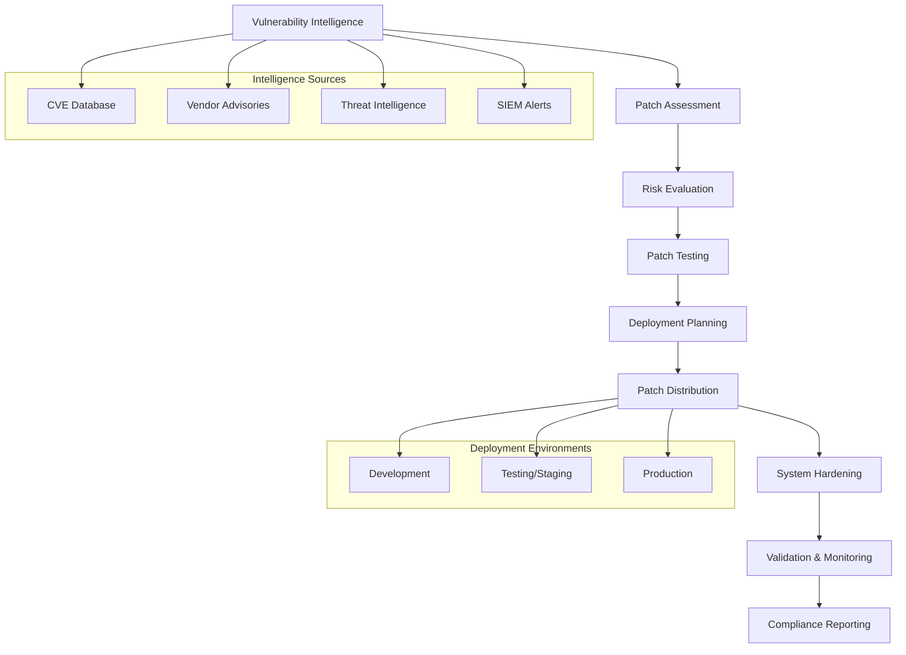
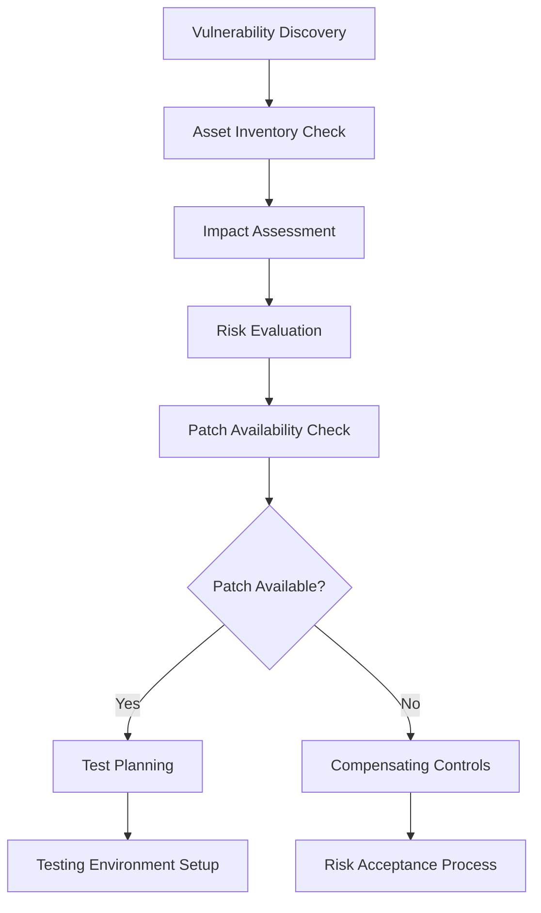
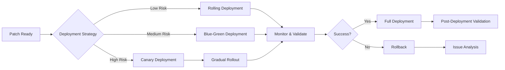
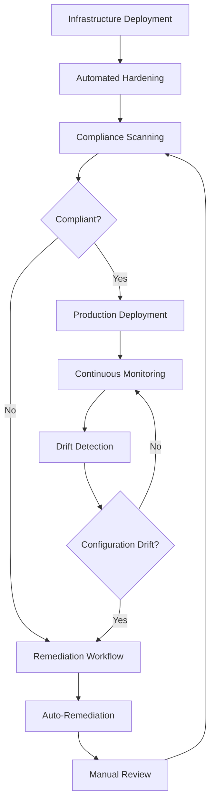
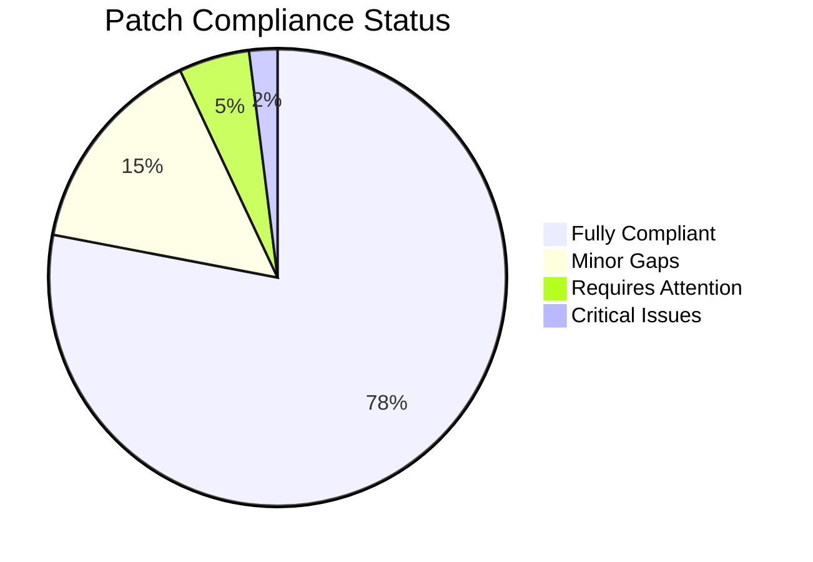
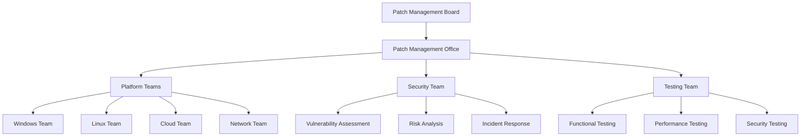
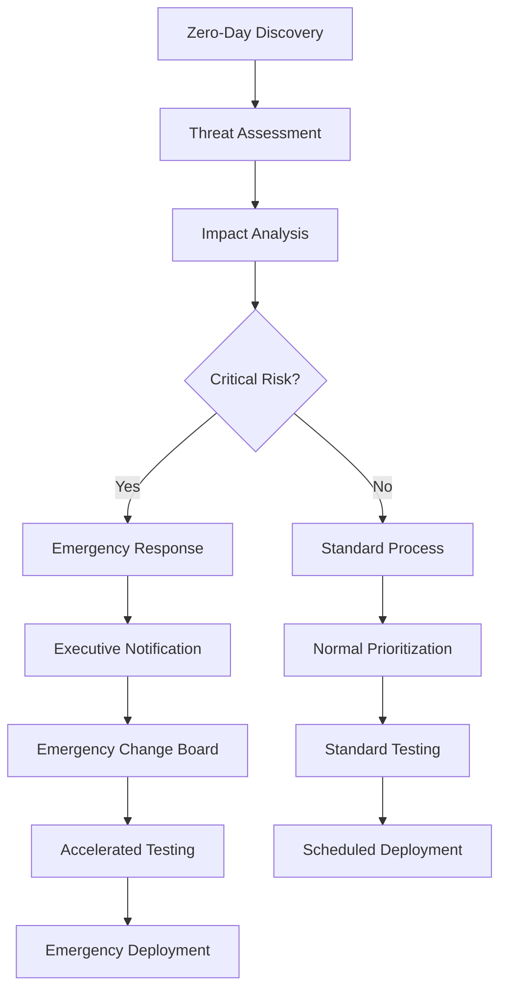

<Callout title="Quieres aprender más?">
  Descarga el [Kit de Ciberseguridad](https://divisioncero.com/home/kit-inicio-ciberseguridad?utm_source=docs.divisioncero.com/docs/kudo).
</Callout>

## 📋 Información General

**Documento:** Gestión de Parches y Endurecimiento (Hardening)  
**Versión:** 1.0.0  
**Fecha:** Enero 2025  
**Clasificación:** Confidencial  
**Propietario:** CISO - Oficina de Seguridad de la Información  

## 🎯 Objetivo y Alcance

### Objetivo
Establecer un marco sistemático y automatizado para la gestión de parches de seguridad y el endurecimiento de sistemas, garantizando que toda la infraestructura de DivisionCero mantenga configuraciones seguras y actualizaciones de seguridad oportunas para minimizar la superficie de ataque.

### Alcance
Esta política cubre:
- **Sistemas Operativos**: Windows, Linux (RHEL, Ubuntu, CentOS), macOS, AIX, Solaris
- **Aplicaciones Empresariales**: Bases de datos, servidores web, middleware
- **Infraestructura de Red**: Routers, switches, firewalls, balanceadores de carga
- **Servicios Cloud**: Instancias IaaS, PaaS, contenedores, funciones serverless
- **Dispositivos Endpoint**: Workstations, laptops, dispositivos móviles
- **Sistemas Embebidos**: IoT devices, sistemas industriales, firmware

## 🏛️ Marco Normativo

### Referencias Regulatorias
- **NIST SP 800-40 Rev. 4** - Guide to Enterprise Patch Management Planning
- **ISO/IEC 27001:2022** - Information Security Management Systems
- **CIS Controls v8** - Critical Security Controls for Effective Cyber Defense
- **NIST Cybersecurity Framework** - Framework for Improving Critical Infrastructure Cybersecurity
- **SANS Critical Security Controls** - Control 7 (Continuous Vulnerability Management)

### Estándares Técnicos
- **Common Vulnerability Scoring System (CVSS) v3.1** - Vulnerability scoring
- **Common Vulnerabilities and Exposures (CVE)** - Vulnerability identifiers
- **Center for Internet Security (CIS) Benchmarks** - Security configuration baselines
- **Security Technical Implementation Guides (STIGs)** - DoD security standards
- **Open Web Application Security Project (OWASP)** - Application security standards

## 🏗️ Arquitectura de Gestión de Parches

### Modelo de Gestión Integrada


### Componentes de la Infraestructura

#### Patch Management Platform
```yaml
Patch_Management_Infrastructure:
  centralized_management:
    primary_tools:
      - windows: "Microsoft WSUS/SCCM"
      - linux: "Red Hat Satellite/Ansible"
      - multi_platform: "Tanium Patch/Qualys VMDR"
    
    automation_engines:
      - infrastructure_as_code: "Ansible, Puppet, Chef"
      - container_orchestration: "Kubernetes operators"
      - cloud_native: "AWS Systems Manager, Azure Update Management"
    
    testing_environments:
      - development: "Isolated dev environment for initial testing"
      - staging: "Production-like environment for validation"
      - pilot_production: "Limited production deployment for verification"
    
    monitoring_integration:
      - vulnerability_scanners: "Nessus, OpenVAS, Rapid7"
      - configuration_management: "Chef InSpec, Ansible Tower"
      - compliance_monitoring: "Cloud Security Posture Management (CSPM)"
```

## 📊 Matriz de Criticidad y Tiempos de Respuesta

### Clasificación de Severidad de Parches

| Nivel CVSS | Severidad | Descripción | Tiempo Máximo | Entornos Afectados | Autorización Requerida |
|------------|-----------|-------------|---------------|-------------------|----------------------|
| **9.0-10.0** | Critical | Vulnerabilidad crítica activamente explotada | menos de 24 horas | Todos | CISO + Change Board |
| **7.0-8.9** | High | Vulnerabilidad severa con alto impacto | menos de 72 horas | Prod + Staging | IT Manager |
| **4.0-6.9** | Medium | Vulnerabilidad moderada | menos de 7 días | Todos | Team Lead |
| **0.1-3.9** | Low | Vulnerabilidad menor | menos de 30 días | Dev/Test primero | Automated approval |

### Matriz de Priorización Contextual

#### Factores de Priorización
```yaml
Prioritization_Matrix:
  threat_landscape_factors:
    - active_exploitation: "Weight: 40%"
    - public_exploit_available: "Weight: 30%"
    - threat_actor_targeting: "Weight: 20%"
    - attack_complexity: "Weight: 10%"
  
  business_impact_factors:
    - system_criticality: "Weight: 35%"
    - data_sensitivity: "Weight: 25%"
    - customer_impact: "Weight: 20%"
    - compliance_requirements: "Weight: 20%"
  
  technical_factors:
    - attack_vector: "Network > Adjacent > Local > Physical"
    - privileges_required: "None > Low > High"
    - user_interaction: "None > Required"
    - scope: "Changed > Unchanged"
```

## 🔧 Proceso de Gestión de Parches

### Ciclo de Vida de Patch Management

#### Fase 1: Discovery and Assessment


#### Patch Assessment Workflow
```yaml
Patch_Assessment_Process:
  vulnerability_analysis:
    data_sources:
      - vendor_security_bulletins: "Microsoft, RedHat, Ubuntu, Oracle"
      - cve_databases: "MITRE CVE, NVD"
      - threat_intelligence: "Commercial feeds, open source intel"
      - vulnerability_scanners: "Nessus, Qualys, Rapid7"
    
    assessment_criteria:
      - exploitability: "Is there a known exploit?"
      - attack_vector: "Network accessible vulnerability?"
      - business_impact: "Critical business function affected?"
      - data_exposure_risk: "Sensitive data at risk?"
  
  patch_evaluation:
    compatibility_analysis:
      - application_dependencies: "Check for breaking changes"
      - system_requirements: "Hardware/software prerequisites"
      - integration_impacts: "API and service dependencies"
      - performance_implications: "Resource utilization changes"
    
    testing_strategy:
      - unit_testing: "Individual component testing"
      - integration_testing: "System integration validation"
      - user_acceptance_testing: "Business function verification"
      - regression_testing: "Ensure no functionality breaks"
```

### Fase 2: Testing and Validation

#### Multi-Stage Testing Pipeline
```yaml
Testing_Pipeline:
  stage_1_development:
    duration: "24-48 hours"
    scope: "Basic functionality and compatibility"
    criteria:
      - system_boots_successfully: "OS level validation"
      - core_services_operational: "Critical service availability"
      - no_obvious_regressions: "Basic smoke testing"
    
  stage_2_staging:
    duration: "48-96 hours"
    scope: "Production-like environment testing"
    criteria:
      - full_application_stack_testing: "End-to-end validation"
      - performance_benchmark_validation: "No significant degradation"
      - security_control_verification: "Security features intact"
      - backup_and_recovery_testing: "Disaster recovery validation"
    
  stage_3_pilot_production:
    duration: "72 hours - 1 week"
    scope: "Limited production deployment"
    criteria:
      - canary_deployment: "5-10% of production systems"
      - real_user_monitoring: "Actual user experience validation"
      - business_process_verification: "Critical workflows functional"
      - rollback_procedure_validation: "Confirmed rollback capability"
```

### Fase 3: Deployment and Monitoring

#### Deployment Strategies


#### Deployment Orchestration
```yaml
Deployment_Orchestration:
  maintenance_windows:
    critical_systems:
      - primary_window: "Saturday 2:00 AM - 6:00 AM"
      - secondary_window: "Sunday 2:00 AM - 6:00 AM"
      - emergency_window: "Any time with executive approval"
    
    non_critical_systems:
      - regular_window: "Tuesday/Thursday 8:00 PM - 11:00 PM"
      - extended_window: "Weekend maintenance allowed"
    
  deployment_automation:
    orchestration_tools:
      - ansible_playbooks: "Linux patch orchestration"
      - powershell_dsc: "Windows configuration management"
      - terraform: "Infrastructure deployment"
      - kubernetes_operators: "Container platform updates"
    
    rollback_mechanisms:
      - system_snapshots: "Pre-patch system state capture"
      - configuration_backups: "Application configuration preservation"
      - database_backups: "Data integrity protection"
      - automated_rollback_triggers: "Performance threshold monitoring"
```

## 🛡️ System Hardening Framework

### CIS Benchmark Implementation

#### Operating System Hardening
```yaml
OS_Hardening_Standards:
  windows_server:
    cis_benchmark: "CIS Microsoft Windows Server 2022 Benchmark v1.0.0"
    key_controls:
      - account_policies: "Password complexity, lockout policies"
      - user_rights_assignment: "Privilege restriction and delegation"
      - security_options: "Authentication and authorization settings"
      - audit_policies: "Comprehensive security event logging"
      - services_configuration: "Disable unnecessary services"
      - network_security: "SMB, RDP, and firewall configuration"
    
  linux_systems:
    cis_benchmark: "CIS Ubuntu Linux 22.04 LTS Benchmark v1.0.0"
    key_controls:
      - filesystem_configuration: "Mount options and permissions"
      - software_updates: "Package management and repositories"
      - network_configuration: "Firewall and network parameters"
      - logging_and_auditing: "rsyslog, auditd configuration"
      - access_authentication: "PAM, SSH, sudo configuration"
      - system_maintenance: "Cron jobs, system integrity checking"
  
  network_devices:
    cisco_ios_hardening:
      - access_control: "AAA configuration and privilege levels"
      - logging_monitoring: "SNMP, syslog, and NTP configuration"
      - network_security: "ACLs, VLANs, and encryption settings"
      - management_security: "SSH, HTTPS, disable unused services"
```

#### Application Hardening Profiles
```yaml
Application_Hardening:
  web_servers:
    apache_httpd:
      - security_headers: "HSTS, CSP, X-Frame-Options"
      - ssl_tls_configuration: "Strong cipher suites, perfect forward secrecy"
      - access_controls: "Authentication, authorization, rate limiting"
      - information_disclosure: "Server signature, error page customization"
    
    nginx:
      - security_modules: "ModSecurity WAF, rate limiting"
      - ssl_configuration: "TLS 1.2+, secure cipher suites"
      - access_logging: "Detailed request logging and monitoring"
      - resource_limits: "Connection limits, request size restrictions"
  
  database_systems:
    mysql_postgresql:
      - authentication: "Strong password policies, certificate authentication"
      - network_security: "SSL/TLS encryption, firewall rules"
      - privilege_management: "Principle of least privilege, role-based access"
      - auditing: "Query logging, connection monitoring"
      - data_protection: "Encryption at rest, backup security"
```

### Cloud Infrastructure Hardening

#### Multi-Cloud Security Baselines
```yaml
Cloud_Hardening:
  aws_security_baseline:
    iam_hardening:
      - root_account_protection: "MFA, access key removal"
      - principle_of_least_privilege: "Minimal required permissions"
      - role_based_access: "Service roles over user credentials"
      - access_key_rotation: "Regular key rotation policy"
    
    network_security:
      - vpc_configuration: "Private subnets, NAT gateways"
      - security_groups: "Restrictive inbound/outbound rules"
      - network_acls: "Additional layer of network security"
      - vpc_flow_logs: "Network traffic monitoring"
    
    data_protection:
      - s3_bucket_hardening: "Block public access, encryption"
      - ebs_encryption: "Encryption at rest for storage"
      - rds_security: "Encryption, VPC placement, access controls"
  
  azure_security_baseline:
    identity_security:
      - azure_ad_configuration: "Conditional access, PIM"
      - service_principal_management: "Certificate authentication"
      - managed_identity: "Eliminate stored credentials"
    
    network_protection:
      - network_security_groups: "Micro-segmentation"
      - azure_firewall: "Application and network filtering"
      - private_endpoints: "Secure service connectivity"
    
    monitoring_compliance:
      - azure_security_center: "Security posture management"
      - azure_monitor: "Comprehensive logging and alerting"
      - compliance_policies: "Regulatory compliance automation"
```

## 🔍 Automated Hardening and Compliance

### Infrastructure as Code (IaC) Hardening

#### Security-First IaC Templates
```yaml
IaC_Security_Templates:
  terraform_modules:
    security_focused_modules:
      - secure_vpc_module: "Pre-hardened network infrastructure"
      - hardened_ec2_module: "CIS compliant instance templates"
      - secure_rds_module: "Encrypted database with security groups"
      - waf_enabled_alb: "Web Application Firewall integration"
    
    security_validation:
      - checkov_integration: "Static analysis for security misconfigurations"
      - tfsec_scanning: "Terraform security analysis"
      - policy_as_code: "Open Policy Agent (OPA) integration"
  
  ansible_hardening_playbooks:
    operating_system_hardening:
      - cis_compliance_playbook: "Automated CIS benchmark implementation"
      - stig_compliance: "DoD STIG automated configuration"
      - custom_security_baselines: "Organization-specific hardening"
    
    application_hardening:
      - web_server_hardening: "Apache/Nginx security configuration"
      - database_hardening: "MySQL/PostgreSQL security setup"
      - container_hardening: "Docker and Kubernetes security"
```

### Continuous Compliance Monitoring

#### Compliance Automation Pipeline


#### Compliance Monitoring Tools
```yaml
Compliance_Monitoring:
  configuration_assessment:
    - aws_config: "AWS resource compliance monitoring"
    - azure_policy: "Azure resource governance and compliance"
    - gcp_security_command_center: "GCP security posture management"
    - chef_inspec: "Infrastructure compliance testing"
  
  vulnerability_assessment:
    - aws_inspector: "Application and infrastructure vulnerability assessment"
    - azure_defender: "Multi-cloud security monitoring"
    - qualys_vmdr: "Vulnerability management and response"
    - rapid7_insightvm: "Vulnerability risk management"
  
  security_monitoring:
    - crowdstrike_falcon: "Endpoint detection and response"
    - splunk_enterprise_security: "Security information and event management"
    - elastic_security: "Open source SIEM and security analytics"
```

## 📈 Métricas y KPIs

### Key Performance Indicators

#### Patch Management Metrics
| Métrica | Objetivo | Método de Medición | Frecuencia |
|---------|----------|-------------------|------------|
| **Mean Time to Patch (MTTP)** | menos de 72h (Critical) | Automated tracking | Diario |
| **Patch Compliance Rate** | más de 95% | Asset inventory vs patches applied | Semanal |
| **Emergency Patch Success Rate** | más de 98% | Deployment success tracking | Por incidente |
| **System Availability During Patching** | más de 99.5% | Service monitoring | Continuo |
| **Rollback Rate** | menos de 5% | Deployment failure tracking | Por deployment |

#### Security Hardening Metrics
```yaml
Hardening_KPIs:
  compliance_metrics:
    - cis_benchmark_compliance: "target: >95% per system"
    - stig_compliance_score: "target: >90% for gov systems"
    - custom_baseline_adherence: "target: >98%"
    - configuration_drift_detection: "target: <4 hours"
  
  security_posture_metrics:
    - vulnerability_remediation_rate: "target: >95% within SLA"
    - security_control_effectiveness: "target: >99% uptime"
    - incident_reduction_rate: "target: 20% YoY reduction"
    - time_to_remediate_misconfigurations: "target: <24 hours"
  
  operational_metrics:
    - automation_coverage: "target: >90% of patch deployments"
    - manual_intervention_rate: "target: <10%"
    - testing_coverage: "target: 100% critical systems"
    - documentation_completeness: "target: 100%"
```

### Dashboard and Reporting

#### Executive Security Dashboard


#### Operational Metrics Dashboard
- **Real-time Patch Status**: Current deployment status across environments
- **Vulnerability Age Distribution**: Time since vulnerability disclosure
- **System Hardening Score**: CIS benchmark compliance percentage
- **Deployment Success Rate**: Patch deployment success trending
- **Security Incident Correlation**: Patches vs security incidents

## 🛠️ Herramientas y Plataformas

### Enterprise Patch Management Solutions

#### Comprehensive Platforms
```yaml
Enterprise_Tools:
  microsoft_ecosystem:
    - wsus: "Windows Server Update Services"
    - sccm: "System Center Configuration Manager"
    - azure_update_management: "Cloud-based patch management"
    - windows_autopatch: "Automated Windows 11 patching"
  
  linux_management:
    - red_hat_satellite: "RHEL/CentOS patch management"
    - ubuntu_landscape: "Ubuntu patch management service"
    - suse_manager: "SLES patch and configuration management"
    - ansible_tower: "Multi-platform automation"
  
  multi_platform_solutions:
    - tanium_patch: "Enterprise-scale patch management"
    - qualys_vmdr: "Vulnerability management and patching"
    - rapid7_insightvm: "Integrated vulnerability and patch management"
    - lansweeper: "IT asset discovery and patch management"
```

#### Open Source and Cloud-Native Tools
```yaml
Open_Source_Tools:
  configuration_management:
    - ansible: "Agentless automation and configuration management"
    - puppet: "Infrastructure automation and compliance"
    - chef: "Infrastructure as code with compliance"
    - salt: "Event-driven automation and orchestration"
  
  vulnerability_scanning:
    - openvas: "Open source vulnerability scanner"
    - nuclei: "Fast vulnerability scanner"
    - nmap: "Network discovery and security auditing"
  
  compliance_monitoring:
    - inspec: "Compliance and security testing framework"
    - prowler: "AWS security best practices assessment"
    - kube_bench: "Kubernetes CIS benchmark checker"
    - docker_bench: "Docker security benchmark"
```

### Cloud-Native Security Tools

#### Container and Kubernetes Security
```yaml
Container_Security:
  image_scanning:
    - twistlock: "Container security platform"
    - aqua_security: "Container security and compliance"
    - clair: "Open source container vulnerability scanner"
    - trivy: "Container vulnerability scanner"
  
  kubernetes_security:
    - falco: "Runtime security monitoring"
    - opa_gatekeeper: "Policy enforcement for Kubernetes"
    - istio_security: "Service mesh security"
    - cert_manager: "Automated certificate management"
  
  serverless_security:
    - aws_lambda_security: "Function-level security monitoring"
    - azure_function_security: "Serverless security assessment"
    - snyk_serverless: "Serverless vulnerability management"
```

## 👥 Roles y Responsabilidades

### Patch Management Organization

#### Governance Structure


#### Roles and Responsibilities
```yaml
Team_Responsibilities:
  patch_management_board:
    - strategic_oversight: "Patch management strategy and policies"
    - risk_acceptance: "Approve exceptions and risk acceptances"
    - resource_allocation: "Budget and staffing decisions"
    - escalation_resolution: "Resolve conflicts and issues"
  
  patch_management_office:
    - program_coordination: "Coordinate across teams and platforms"
    - process_standardization: "Develop and maintain procedures"
    - metrics_reporting: "Track and report on KPIs"
    - tool_evaluation: "Assess and recommend tooling"
  
  platform_teams:
    - patch_deployment: "Execute patch installations"
    - system_maintenance: "Maintain platform health"
    - technical_testing: "Validate patch functionality"
    - rollback_execution: "Perform rollbacks when necessary"
  
  security_team:
    - vulnerability_analysis: "Assess security implications"
    - threat_intelligence: "Provide threat context"
    - risk_assessment: "Evaluate and prioritize risks"
    - security_validation: "Verify security controls"
  
  testing_team:
    - test_planning: "Develop comprehensive test plans"
    - environment_management: "Maintain testing infrastructure"
    - regression_testing: "Ensure no functionality breaks"
    - performance_validation: "Verify performance impact"
```

### Training and Competency Development

#### Required Training Programs
- **Patch Management Fundamentals**: All technical staff - Annual
- **Security Vulnerability Assessment**: Security team - Bi-annual
- **Emergency Response Procedures**: All teams - Quarterly
- **Tool-Specific Training**: Platform teams - As needed
- **Compliance and Audit**: PMO staff - Annual

## 📋 Emergency Procedures

### Zero-Day Response Protocol

#### Emergency Patch Process


#### Emergency Response Procedures
```yaml
Emergency_Response:
  activation_criteria:
    - active_exploitation: "Known exploitation in the wild"
    - critical_infrastructure_risk: "Risk to critical business operations"
    - regulatory_requirement: "Mandatory regulatory response"
    - customer_data_exposure: "Potential for data breach"
  
  response_timeline:
    - initial_assessment: "Within 2 hours of disclosure"
    - risk_evaluation: "Within 4 hours"
    - deployment_decision: "Within 8 hours"
    - emergency_patching: "Within 24 hours if critical"
  
  emergency_procedures:
    - war_room_activation: "Dedicated response team coordination"
    - communication_plan: "Stakeholder notification protocol"
    - accelerated_testing: "Reduced testing with focused validation"
    - rollback_readiness: "Immediate rollback capability"
```

## 🔄 Continuous Improvement

### Patch Management Maturity Model

#### Maturity Levels
| Level | Description | Characteristics | Target Timeline |
|-------|-------------|----------------|-----------------|
| **1 - Ad Hoc** | Reactive patching | Manual processes, inconsistent | Baseline |
| **2 - Managed** | Basic processes established | Some automation, defined roles | Q2 2025 |
| **3 - Defined** | Standardized processes | Integrated tools, metrics tracking | Q4 2025 |
| **4 - Quantitatively Managed** | Data-driven optimization | Advanced analytics, predictive | Q2 2026 |
| **5 - Optimizing** | Continuous improvement | AI-driven, self-healing systems | Q4 2027 |

### Automation Roadmap 2025-2027

#### 2025 - Foundation Building
```yaml
2025_objectives:
  process_automation:
    - patch_assessment_automation: "Automated risk scoring"
    - deployment_orchestration: "Multi-platform deployment automation"
    - testing_automation: "Automated regression testing"
    - rollback_automation: "Automated rollback triggers"
  
  tool_integration:
    - siem_integration: "Patch status correlation with security events"
    - itsm_integration: "Automated change management"
    - cmdb_integration: "Asset tracking and dependency mapping"
```

#### 2026 - Intelligence Integration
- **Machine Learning**: Predictive patch impact analysis
- **AI-Powered Testing**: Intelligent test case generation
- **Behavioral Analysis**: Anomaly detection post-patching
- **Risk Prediction**: ML-based vulnerability prioritization

#### 2027 - Autonomous Operations
- **Self-Healing Systems**: Automated remediation and recovery
- **Predictive Maintenance**: Proactive system hardening
- **Zero-Touch Patching**: Fully automated patch lifecycle
- **Adaptive Security**: Dynamic hardening based on threats

---

## 📚 Referencias y Documentos Relacionados

### Políticas Relacionadas
- [Escaneo Continuo de Vulnerabilidades](escaneo-continuo-vulnerabilidades)
- [Política de Gestión de Vulnerabilidades](politica-gestion-vulnerabilidades)
- [Gestión de Parches y Configuración de Endpoints](gestion-parches-configuracion-endpoints)
- [Política de Gestión de Cambios](politica-gestion-cambios)

### Marcos de Referencia
- **NIST SP 800-40 Rev. 4** - Guide to Enterprise Patch Management Planning
- **CIS Controls v8** - Critical Security Controls for Effective Cyber Defense
- **SANS Top 20 Critical Security Controls**
- **OWASP Application Security Verification Standard**

### Herramientas y Recursos
- **Common Vulnerabilities and Exposures (CVE)** - Vulnerability database
- **National Vulnerability Database (NVD)** - Vulnerability management data
- **CIS Benchmarks** - Security configuration guidelines
- **Security Technical Implementation Guides (STIGs)** - Security standards

---

**Documento aprobado por:**  
**CISO - Oficina de Seguridad de la Información**  
**Fecha:** Enero 2025  
**Próxima revisión:** Enero 2026


