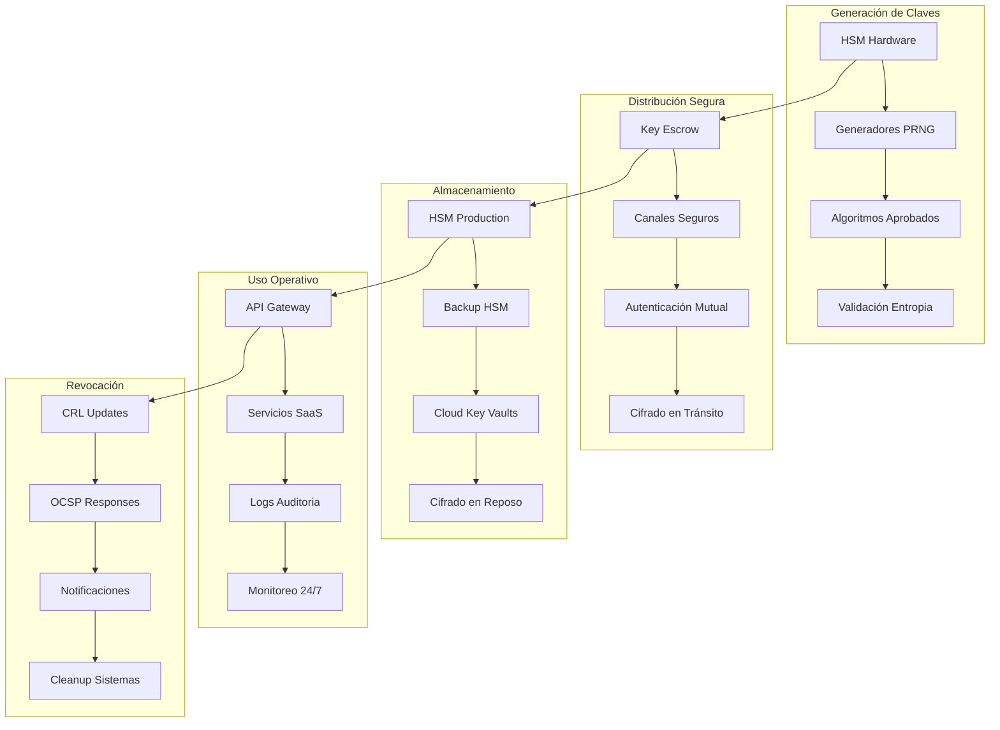
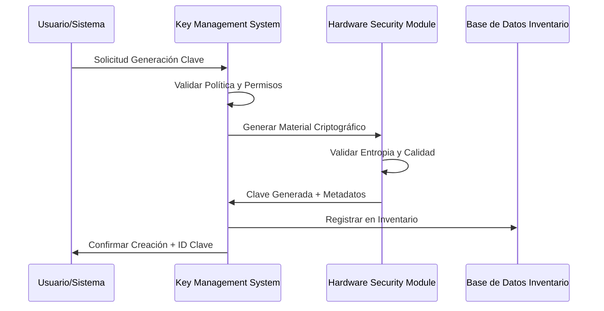
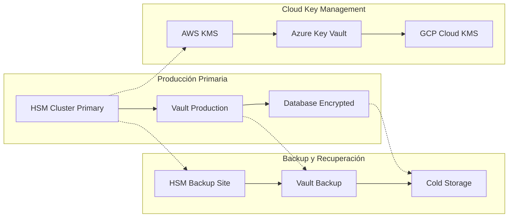
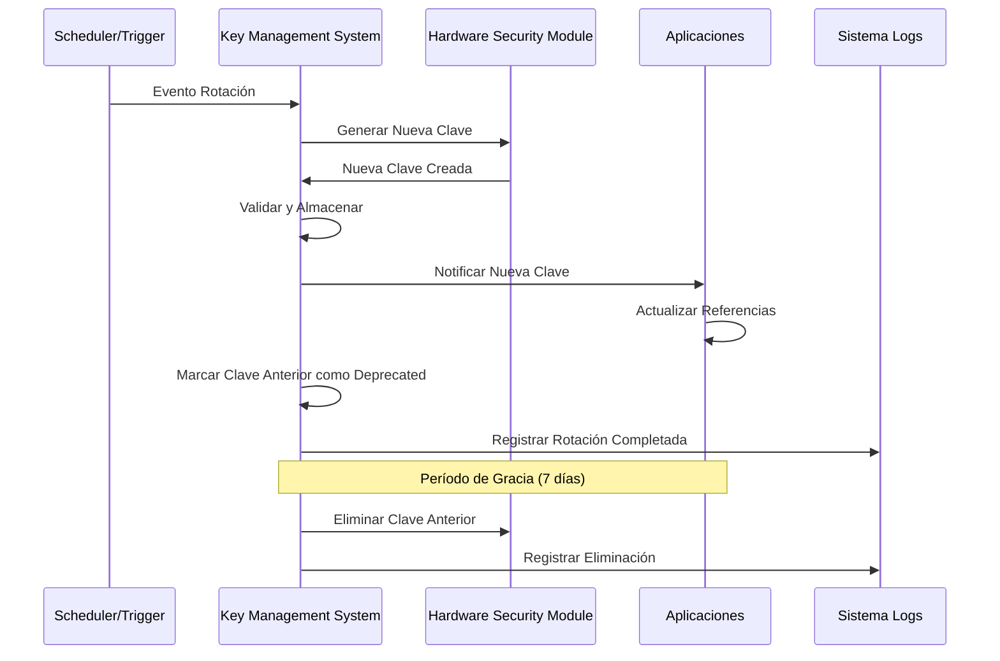
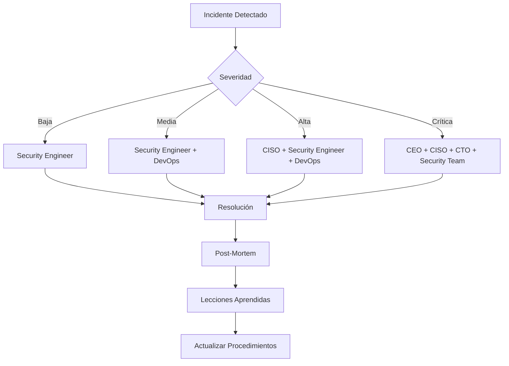

# Inventario y Ciclo de Vida de Llaves Criptográficas

## Información del Documento

| Campo | Valor |
|-------|--------|
| **Código** | POL-CRYP-KEY-001 |
| **Versión** | 1.0.0 |
| **Fecha Creación** | 2024-12-21 |
| **Fecha Revisión** | 2024-12-21 |
| **Responsable** | CISO - Chief Information Security Officer |
| **Aprobado por** | CEO - Chief Executive Officer |
| **Tipo** | Política Organizacional |
| **Clasificación** | Confidencial |

## Objetivo

Establecer el marco normativo y operativo para la gestión integral del inventario y ciclo de vida de claves criptográficas en DivisionCero, garantizando la confidencialidad, integridad y disponibilidad de la información mediante controles criptográficos robustos y procesos automatizados de gestión de claves.

## Alcance

Esta política aplica para:
- Todas las claves criptográficas utilizadas en sistemas SaaS de DivisionCero
- Claves de cifrado simétrico y asimétrico
- Claves de firmado digital y validación
- Material criptográfico de infraestructura de red
- Tokens y secretos de autenticación
- Claves de bases de datos y almacenamiento
- Material criptográfico de servicios cloud (AWS, Azure, GCP)

## Marco Normativo

### Cumplimiento Regulatorio
- **ISO/IEC 27001:2022** - Controles A.10.1 (Gestión de claves criptográficas)
- **NIST SP 800-57** - Recomendaciones para gestión de claves
- **FIPS 140-2/140-3** - Estándares de módulos criptográficos
- **Common Criteria** - Evaluación de productos de seguridad
- **GDPR Artículo 32** - Seguridad del tratamiento
- **SOC 2 Type II** - Controles de seguridad y disponibilidad

### Estándares Técnicos
- **PKCS #11** - API estándar para tokens criptográficos
- **RFC 5652** - Sintaxis de mensajes criptográficos
- **X.509** - Certificados de clave pública
- **RFC 3394** - Key Wrap Algorithm
- **ANSI X9.31** - Generación de claves RSA

## Arquitectura de Gestión de Claves



## Clasificación de Claves Criptográficas

### Por Función Criptográfica

#### Claves de Cifrado
```yaml
clasificacion_cifrado:
  simetrico:
    - AES-256-GCM: "Cifrado de datos en reposo"
    - ChaCha20-Poly1305: "Cifrado de comunicaciones"
    - AES-256-CCM: "Cifrado de dispositivos IoT"
  
  asimetrico:
    - RSA-4096: "Cifrado de claves de sesión"
    - ECDH P-384: "Intercambio de claves"
    - Curve25519: "Cifrado de mensajería"
```

#### Claves de Firmado
```yaml
clasificacion_firmado:
  digital:
    - RSA-3072: "Firmado de documentos"
    - ECDSA P-256: "Firmado de transacciones"
    - EdDSA Ed25519: "Firmado de código"
  
  autenticacion:
    - HMAC-SHA256: "Integridad de mensajes"
    - CMAC-AES: "Autenticación de dispositivos"
```

### Por Criticidad de Negocio

| Nivel | Descripción | Algoritmos | Rotación | Escrow |
|-------|-------------|------------|----------|---------|
| **Crítico** | Claves maestras, CA raíz | RSA-4096, ECDSA P-384 | 5 años | Mandatorio |
| **Alto** | Claves de servicios core | RSA-3072, AES-256 | 2 años | Mandatorio |
| **Medio** | Claves aplicaciones | RSA-2048, AES-256 | 1 año | Recomendado |
| **Bajo** | Claves temporales | AES-128, ECDSA P-256 | 6 meses | Opcional |

## Ciclo de Vida de Claves

### Fase 1: Generación y Creación

#### Proceso de Generación


#### Criterios de Generación
- **Entropía mínima**: 256 bits para claves simétricas
- **Fuentes aleatorias**: TRNG certificados FIPS 140-2 Level 3+
- **Validación matemática**: Verificación de propiedades criptográficas
- **Metadatos obligatorios**: Propósito, algoritmo, fecha, propietario

#### Algoritmos Aprobados
```yaml
algoritmos_aprobados:
  simetricos:
    aes:
      tamaños: [256]
      modos: [GCM, CCM, CTR]
      usos: ["cifrado_datos", "cifrado_comunicaciones"]
    
    chacha20_poly1305:
      tamaños: [256]
      usos: ["comunicaciones_mobiles", "vpn"]
  
  asimetricos:
    rsa:
      tamaños: [3072, 4096]
      padding: [OAEP, PSS]
      usos: ["cifrado_claves", "firmado_digital"]
    
    ecc:
      curvas: [P-256, P-384, P-521, Curve25519, Ed25519]
      usos: ["ecdh", "ecdsa", "firmado_codigo"]
```

### Fase 2: Distribución y Despliegue

#### Canales de Distribución
- **API REST segura**: TLS 1.3 con autenticación mutua
- **SSH tunneling**: Para sistemas legacy
- **Protocolos proprietarios**: HSM-to-HSM communication
- **Backup offline**: Medios físicos seguros

#### Controles de Distribución
```yaml
controles_distribucion:
  autenticacion:
    - certificados_x509: "Identidad del solicitante"
    - tokens_api: "Autorización temporal"
    - mfa_obligatorio: "Factor adicional requerido"
  
  cifrado_transporte:
    - tls_1_3: "Cifrado en tránsito"
    - perfect_forward_secrecy: "Secreto hacia adelante"
    - pinning_certificados: "Prevención MITM"
  
  auditoria:
    - logs_detallados: "Quien, que, cuando, donde"
    - checksums: "Integridad del material"
    - timestamps: "Sellado temporal"
```

### Fase 3: Almacenamiento Seguro

#### Infraestructura de Almacenamiento


#### Niveles de Protección
| Nivel | Almacenamiento | Cifrado | Acceso | Backup |
|-------|----------------|---------|--------|---------|
| **L1 - Máximo** | HSM FIPS 140-2 L4 | Hardware | Autenticación dual | Offline vault |
| **L2 - Alto** | HSM FIPS 140-2 L3 | Hardware + Software | Certificados | Cloud HSM |
| **L3 - Medio** | Software vault | AES-256-GCM | API keys + MFA | Cloud encrypted |
| **L4 - Básico** | Database encrypted | AES-256 | Password + 2FA | Regular backup |

### Fase 4: Uso Operativo

#### Controles de Uso
```yaml
controles_uso:
  autorizacion:
    - rbac_granular: "Permisos por función y contexto"
    - time_based_access: "Ventanas de acceso temporal"
    - ip_whitelisting: "Restricción geográfica"
  
  monitorizacion:
    - real_time_logging: "Logs en tiempo real"
    - anomaly_detection: "Detección de patrones anómalos"
    - usage_analytics: "Análisis de uso y tendencias"
  
  proteccion:
    - rate_limiting: "Limitación de operaciones"
    - key_versioning: "Versionado de claves"
    - crypto_agility: "Migración de algoritmos"
```

#### APIs de Gestión
```yaml
api_endpoints:
  key_operations:
    - POST /api/v1/keys/generate
    - GET /api/v1/keys/{id}/metadata
    - PUT /api/v1/keys/{id}/rotate
    - DELETE /api/v1/keys/{id}/revoke
  
  inventory_management:
    - GET /api/v1/inventory/search
    - GET /api/v1/inventory/expiring
    - POST /api/v1/inventory/audit
    - GET /api/v1/inventory/compliance
```

### Fase 5: Rotación y Actualización

#### Política de Rotación
```yaml
rotacion_politica:
  automatica:
    triggers:
      - tiempo_vida: "Basado en edad de la clave"
      - uso_intensivo: "Número de operaciones"
      - eventos_seguridad: "Compromisos detectados"
    
    calendario:
      claves_maestras: "60 meses"
      claves_intermedias: "24 meses"
      claves_servicios: "12 meses"
      claves_sesion: "24 horas"
  
  manual:
    circunstancias:
      - compromiso_sospechado: "Inmediato"
      - empleado_desvinculado: "48 horas"
      - actualizacion_algoritmo: "Planificado"
      - auditoria_hallazgos: "30 días"
```

#### Proceso de Rotación


### Fase 6: Revocación y Eliminación

#### Criterios de Revocación
- **Compromiso confirmado**: Evidencia de exposición
- **Cambio organizacional**: Reestructuración de equipos
- **Fin de proyecto**: Cierre de servicios o aplicaciones
- **Violación de política**: Uso indebido detectado
- **Expiración natural**: Fin del ciclo de vida programado

#### Proceso de Eliminación Segura
```yaml
eliminacion_proceso:
  pasos:
    1_revocacion:
      - actualizar_crl: "Certificate Revocation List"
      - notificar_sistemas: "Sistemas dependientes"
      - bloquear_uso: "Prohibir nuevas operaciones"
    
    2_limpieza:
      - eliminar_cache: "Cachés en memoria"
      - limpiar_logs: "Logs sensibles"
      - actualizar_inventario: "Estado revocado"
    
    3_destruccion:
      - sobrescritura_multiple: "3+ pasadas random"
      - validacion_eliminacion: "Verificar destrucción"
      - certificacion_destruccion: "Documento formal"
```

## Inventario de Claves Criptográficas

### Estructura del Inventario

#### Metadatos Obligatorios
```yaml
metadatos_clave:
  identificacion:
    key_id: "Identificador único UUID"
    name: "Nombre descriptivo"
    alias: "Alias para referencia"
    fingerprint: "Hash SHA-256 de la clave"
  
  clasificacion:
    algorithm: "Algoritmo criptográfico"
    key_size: "Tamaño en bits"
    purpose: "Propósito de uso"
    criticality: "Nivel de criticidad (1-5)"
  
  ciclo_vida:
    created_date: "Fecha de creación"
    activation_date: "Fecha de activación"
    expiration_date: "Fecha de expiración"
    status: "Estado actual"
  
  ownership:
    owner: "Propietario responsable"
    custodian: "Custodio técnico"
    business_unit: "Unidad de negocio"
    application: "Aplicación asociada"
  
  seguridad:
    generation_method: "Método de generación"
    storage_location: "Ubicación de almacenamiento"
    backup_status: "Estado de respaldo"
    last_audit: "Última auditoría"
```

#### Base de Datos de Inventario
```sql
-- Tabla principal de inventario
CREATE TABLE cryptographic_keys (
    key_id UUID PRIMARY KEY,
    name VARCHAR(255) NOT NULL,
    algorithm VARCHAR(50) NOT NULL,
    key_size INTEGER NOT NULL,
    purpose VARCHAR(100) NOT NULL,
    criticality INTEGER CHECK (criticality BETWEEN 1 AND 5),
    owner VARCHAR(255) NOT NULL,
    status VARCHAR(20) NOT NULL DEFAULT 'active',
    created_at TIMESTAMP WITH TIME ZONE DEFAULT NOW(),
    expires_at TIMESTAMP WITH TIME ZONE,
    last_audited TIMESTAMP WITH TIME ZONE,
    metadata JSONB,
    CONSTRAINT valid_status CHECK (status IN ('pending', 'active', 'deprecated', 'revoked', 'destroyed'))
);

-- Índices para consultas frecuentes
CREATE INDEX idx_keys_expiration ON cryptographic_keys(expires_at) WHERE status = 'active';
CREATE INDEX idx_keys_owner ON cryptographic_keys(owner);
CREATE INDEX idx_keys_algorithm ON cryptographic_keys(algorithm);
CREATE INDEX idx_keys_criticality ON cryptographic_keys(criticality);
```

### Automatización del Inventario

#### Descubrimiento Automático
```yaml
discovery_sources:
  infrastructure:
    - vault_hashicorp: "Vault de HashiCorp"
    - aws_kms: "AWS Key Management Service"
    - azure_keyvault: "Azure Key Vault"
    - gcp_kms: "Google Cloud KMS"
  
  applications:
    - ssl_certificates: "Certificados SSL/TLS"
    - api_keys: "Claves de API"
    - database_keys: "Claves de bases de datos"
    - application_secrets: "Secretos de aplicaciones"
  
  network:
    - vpn_keys: "Claves VPN"
    - wifi_psk: "Claves WiFi empresarial"
    - firewall_certs: "Certificados de firewall"
```

#### Scripts de Auditoría
```python
#!/usr/bin/env python3
"""
Script de auditoría automática del inventario de claves
"""

import json
import boto3
import hashlib
from datetime import datetime, timedelta
from typing import Dict, List

class CryptographicKeyAuditor:
    def __init__(self, config_file: str):
        with open(config_file, 'r') as f:
            self.config = json.load(f)
    
    def audit_aws_kms(self) -> List[Dict]:
        """Auditar claves en AWS KMS"""
        kms = boto3.client('kms', region_name=self.config['aws']['region'])
        keys = []
        
        # Listar todas las claves
        paginator = kms.get_paginator('list_keys')
        for page in paginator.paginate():
            for key in page['Keys']:
                key_info = kms.describe_key(KeyId=key['KeyId'])
                metadata = key_info['KeyMetadata']
                
                keys.append({
                    'key_id': metadata['KeyId'],
                    'algorithm': metadata.get('KeySpec', 'AES_256'),
                    'status': metadata['KeyState'],
                    'created_date': metadata['CreationDate'].isoformat(),
                    'source': 'AWS_KMS'
                })
        
        return keys
    
    def check_expiring_keys(self, days_threshold: int = 30) -> List[Dict]:
        """Identificar claves próximas a expirar"""
        # Conectar a base de datos de inventario
        # Implementar lógica de consulta
        pass
    
    def generate_compliance_report(self) -> Dict:
        """Generar reporte de cumplimiento"""
        return {
            'total_keys': self.count_total_keys(),
            'expiring_soon': len(self.check_expiring_keys()),
            'compliance_score': self.calculate_compliance_score(),
            'recommendations': self.get_recommendations()
        }
```

## Controles de Seguridad

### Controles Preventivos

#### Generación Segura
```yaml
controles_generacion:
  entropia:
    - fuentes_certificadas: "TRNG FIPS 140-2 Level 3+"
    - pruebas_estadisticas: "Test de aleatoriedad NIST"
    - validacion_entropia: "Mínimo 256 bits efectivos"
  
  algoritmos:
    - whitelist_aprobados: "Solo algoritmos autorizados"
    - parametros_seguros: "Configuraciones criptográficas"
    - validacion_matematica: "Verificación de propiedades"
```

#### Protección de Almacenamiento
```yaml
controles_almacenamiento:
  hardware:
    - hsm_certificado: "Hardware Security Modules FIPS"
    - tamper_resistance: "Resistencia a manipulación"
    - secure_enclaves: "Enclaves seguros en CPU"
  
  software:
    - encryption_at_rest: "Cifrado en reposo AES-256"
    - key_wrapping: "Envoltorio de claves DEK/KEK"
    - secure_memory: "Memoria no paginable"
```

### Controles Detectivos

#### Monitorización Continua
```yaml
monitorizacion:
  logs_auditoria:
    eventos:
      - key_generation: "Generación de claves"
      - key_access: "Acceso a claves"
      - key_modification: "Modificación de metadatos"
      - key_deletion: "Eliminación de claves"
    
    alertas:
      - acceso_no_autorizado: "Tentativas de acceso fallidas"
      - uso_anormal: "Patrones de uso atípicos"
      - claves_expiradas: "Uso de claves vencidas"
      - violaciones_politica: "Incumplimiento de políticas"
```

#### Análisis de Anomalías
```python
# Ejemplo de detección de anomalías
class KeyUsageAnomalyDetector:
    def __init__(self):
        self.baseline_patterns = {}
    
    def analyze_usage_pattern(self, key_id: str, usage_data: Dict):
        """Analizar patrones de uso de claves"""
        current_usage = usage_data['operations_per_hour']
        baseline = self.baseline_patterns.get(key_id, {})
        
        if baseline:
            avg_usage = baseline['average']
            std_dev = baseline['std_deviation']
            
            # Detectar anomalías usando regla 3-sigma
            if abs(current_usage - avg_usage) > 3 * std_dev:
                return {
                    'anomaly_detected': True,
                    'severity': 'high' if current_usage > avg_usage * 2 else 'medium',
                    'description': f'Uso anómalo detectado: {current_usage} ops/h vs {avg_usage} promedio'
                }
        
        return {'anomaly_detected': False}
```

### Controles Correctivos

#### Respuesta a Incidentes
```yaml
respuesta_incidentes:
  compromiso_clave:
    pasos_inmediatos:
      1: "Revocar clave comprometida"
      2: "Notificar sistemas dependientes"
      3: "Generar nueva clave de reemplazo"
      4: "Actualizar configuraciones"
      5: "Investigar causa raíz"
    
    timeline:
      - deteccion: "0-15 minutos"
      - respuesta_inicial: "15-30 minutos"
      - contencion: "30-60 minutos"
      - recuperacion: "1-4 horas"
      - post_incidente: "24-72 horas"
```

## Automatización y Herramientas

### Plataformas de Gestión

#### HashiCorp Vault
```hcl
# Configuración de Vault para gestión de claves
storage "consul" {
  address = "127.0.0.1:8500"
  path    = "vault/"
}

listener "tcp" {
  address     = "0.0.0.0:8200"
  tls_cert_file = "/etc/vault/vault.crt"
  tls_key_file  = "/etc/vault/vault.key"
}

seal "awskms" {
  region     = "us-west-2"
  kms_key_id = "12345678-1234-1234-1234-123456789012"
}

# Motor de claves de tránsito
path "transit/*" {
  capabilities = ["create", "read", "update", "delete", "list"]
}
```

#### Integración AWS KMS
```python
import boto3
from vault import VaultClient

class HybridKeyManager:
    def __init__(self):
        self.kms = boto3.client('kms')
        self.vault = VaultClient()
    
    def create_hybrid_key(self, purpose: str, algorithm: str):
        """Crear clave híbrida con respaldo en AWS KMS"""
        # Crear DEK en Vault
        dek_response = self.vault.generate_data_key(
            key_name=f"dek-{purpose}",
            algorithm=algorithm
        )
        
        # Cifrar DEK con AWS KMS KEK
        encrypted_dek = self.kms.encrypt(
            KeyId='alias/divisioncero-master-key',
            Plaintext=dek_response['key'],
            EncryptionContext={'purpose': purpose}
        )
        
        return {
            'dek_id': dek_response['key_id'],
            'encrypted_dek': encrypted_dek['CiphertextBlob'],
            'algorithm': algorithm
        }
```

### Automatización CI/CD

#### Pipeline de Rotación
```yaml
# .github/workflows/key-rotation.yml
name: Automated Key Rotation

on:
  schedule:
    - cron: '0 2 * * 0'  # Cada domingo a las 2 AM
  workflow_dispatch:

jobs:
  rotate-keys:
    runs-on: ubuntu-latest
    steps:
      - name: Checkout code
        uses: actions/checkout@v3
      
      - name: Setup Python
        uses: actions/setup-python@v4
        with:
          python-version: '3.11'
      
      - name: Install dependencies
        run: |
          pip install -r requirements.txt
      
      - name: Check expiring keys
        run: |
          python scripts/check_expiring_keys.py --days 30
      
      - name: Rotate keys
        env:
          VAULT_TOKEN: ${{ secrets.VAULT_TOKEN }}
          AWS_ACCESS_KEY_ID: ${{ secrets.AWS_ACCESS_KEY_ID }}
          AWS_SECRET_ACCESS_KEY: ${{ secrets.AWS_SECRET_ACCESS_KEY }}
        run: |
          python scripts/rotate_keys.py --auto-approve
      
      - name: Update inventory
        run: |
          python scripts/update_inventory.py
      
      - name: Notify teams
        uses: 8398a7/action-slack@v3
        with:
          status: ${{ job.status }}
          channel: '#security-alerts'
```

### Herramientas de Auditoría

#### Script de Compliance
```bash
#!/bin/bash
# audit_crypto_compliance.sh

echo "=== Auditoría de Cumplimiento Criptográfico ==="
echo "Fecha: $(date)"
echo "=========================================="

# Verificar claves próximas a expirar
echo "1. Claves próximas a expirar (30 días):"
python3 scripts/expiring_keys.py --days 30

# Auditar algoritmos deprecated
echo "2. Algoritmos deprecados en uso:"
python3 scripts/deprecated_algorithms.py

# Verificar respaldos
echo "3. Estado de respaldos de claves críticas:"
python3 scripts/backup_status.py --criticality high

# Comprobar accesos no autorizados
echo "4. Intentos de acceso no autorizado (24h):"
python3 scripts/unauthorized_access.py --hours 24

# Generar reporte de compliance
echo "5. Generando reporte de cumplimiento..."
python3 scripts/compliance_report.py --output /tmp/compliance_report.pdf

echo "Auditoría completada. Reporte disponible en /tmp/compliance_report.pdf"
```

## Roles y Responsabilidades

### Matriz RACI

| Actividad | CISO | Security Engineer | DevOps | SysAdmin | Auditor |
|-----------|------|------------------|--------|----------|---------|
| **Política de Gestión** | A | R | C | I | I |
| **Generación de Claves** | A | R | C | I | I |
| **Distribución Segura** | A | C | R | C | I |
| **Monitorización** | A | R | C | C | I |
| **Rotación Automática** | A | C | R | C | I |
| **Auditorías Regulares** | A | C | I | I | R |
| **Respuesta Incidentes** | A | R | C | C | I |
| **Compliance Reporting** | A | R | C | I | C |

### Responsabilidades Específicas

#### CISO (Chief Information Security Officer)
- Aprobar políticas y procedimientos de gestión de claves
- Definir niveles de criticidad y clasificación
- Supervisar programa de compliance criptográfico
- Aprobar excepciones a las políticas establecidas

#### Security Engineer
- Implementar controles técnicos de gestión de claves
- Configurar y mantener infraestructura HSM
- Desarrollar scripts de automatización y monitorización
- Responder a incidentes relacionados con claves

#### DevOps Engineer
- Integrar gestión de claves en pipelines CI/CD
- Automatizar rotación y despliegue de claves
- Mantener infraestructura de Key Management Systems
- Implementar monitorización y alertas operativas

## Métricas y KPIs

### Indicadores de Gestión

#### Métricas Operativas
```yaml
metricas_operativas:
  disponibilidad:
    - uptime_kms: "99.95% mensual"
    - tiempo_generacion: "menos de 5 segundos"
    - tiempo_distribucion: "menos de 30 segundos"
  
  seguridad:
    - claves_comprometidas: "0 por trimestre"
    - incidentes_acceso: "menos de 5 por mes"
    - vulnerabilidades_criticas: "0 abiertas"
  
  compliance:
    - cobertura_inventario: "100%"
    - auditorias_completadas: "4 por año"
    - politicas_actualizadas: "revisión anual"
```

#### Dashboard de Monitorización
```python
# Métricas para dashboard en tiempo real
class CryptoKeyMetrics:
    def get_key_statistics(self):
        return {
            'total_keys': self.count_all_keys(),
            'active_keys': self.count_active_keys(),
            'expiring_30_days': self.count_expiring_keys(30),
            'critical_keys': self.count_critical_keys(),
            'rotation_due': self.count_rotation_due(),
            'compliance_score': self.calculate_compliance_score()
        }
    
    def get_algorithm_distribution(self):
        """Distribución de algoritmos en uso"""
        return {
            'AES-256': 65,    # 65% de las claves
            'RSA-3072': 20,   # 20% de las claves
            'ECDSA-P256': 10, # 10% de las claves
            'Other': 5        # 5% de las claves
        }
```

### Reportes de Compliance

#### Reporte Mensual
```markdown
# Reporte Mensual - Gestión de Claves Criptográficas
**Período**: Diciembre 2024
**Generado**: 2024-12-31

## Resumen Ejecutivo
- Total de claves gestionadas: 1,247
- Claves rotadas automáticamente: 156
- Incidentes de seguridad: 0
- Score de compliance: 98.5%

## Métricas Clave
- Tiempo promedio de generación: 3.2 segundos
- Disponibilidad del servicio: 99.97%
- Claves próximas a expirar: 23 (30 días)

## Acciones Requeridas
1. Rotar 23 claves que expiran en enero
2. Actualizar 3 sistemas con algoritmos deprecados
3. Completar auditoría trimestral pendiente
```

## Continuidad y Recuperación

### Plan de Continuidad

#### Escenarios de Contingencia
```yaml
escenarios_contingencia:
  fallo_hsm_primario:
    impacto: "Alto"
    rto: "15 minutos"
    rpo: "0 (sin pérdida de datos)"
    procedimiento:
      - activar_hsm_secundario
      - redirigir_trafico_kms
      - validar_operaciones
      - notificar_stakeholders
  
  compromiso_kms:
    impacto: "Crítico"
    rto: "1 hora"
    rpo: "15 minutos"
    procedimiento:
      - aislar_sistema_comprometido
      - activar_kms_backup
      - rotar_claves_afectadas
      - investigar_incidente
  
  perdida_conectividad:
    impacto: "Medio"
    rto: "30 minutos"
    rpo: "5 minutos"
    procedimiento:
      - activar_cache_local
      - usar_claves_respaldo
      - restablecer_conectividad
      - sincronizar_cambios
```

### Procedimientos de Backup

#### Estrategia de Respaldo
```yaml
backup_strategy:
  frecuencia:
    claves_criticas: "Tiempo real"
    claves_altas: "Cada hora"
    claves_medias: "Cada 4 horas"
    claves_bajas: "Diario"
  
  ubicaciones:
    - hsm_backup_site: "Sitio de respaldo principal"
    - cloud_backup: "Respaldo en nube cifrado"
    - offline_vault: "Bóveda física offline"
  
  retension:
    operacional: "90 días"
    compliance: "7 años"
    archival: "Permanente para claves maestras"
```

## Procedimientos de Emergencia

### Compromiso de Claves

#### Respuesta Inmediata
```bash
#!/bin/bash
# emergency_key_revocation.sh

KEY_ID=$1
REASON=$2

if [ -z "$KEY_ID" ] || [ -z "$REASON" ]; then
    echo "Uso: $0 <KEY_ID> <REASON>"
    exit 1
fi

echo "=== PROCEDIMIENTO DE EMERGENCIA ==="
echo "Revocando clave: $KEY_ID"
echo "Razón: $REASON"
echo "Timestamp: $(date)"

# 1. Revocar inmediatamente
vault kv metadata delete secret/keys/$KEY_ID
aws kms disable-key --key-id $KEY_ID

# 2. Notificar sistemas
curl -X POST https://alerts.divisioncero.com/api/emergency \
  -H "Content-Type: application/json" \
  -d "{\"type\":\"key_compromise\",\"key_id\":\"$KEY_ID\",\"reason\":\"$REASON\"}"

# 3. Actualizar CRL
openssl ca -revoke certs/$KEY_ID.pem -crl_reason compromised

# 4. Generar reporte
echo "Clave $KEY_ID revocada por: $REASON" >> /var/log/emergency_revocations.log

echo "Revocación completada. Revise sistemas dependientes."
```

## Capacitación y Concienciación

### Programa de Formación

#### Módulos de Capacitación
1. **Fundamentos de Criptografía** (4 horas)
   - Conceptos básicos de criptografía
   - Algoritmos simétricos y asimétricos
   - Funciones hash y firmas digitales

2. **Gestión de Claves** (8 horas)
   - Ciclo de vida de claves
   - Herramientas de gestión (Vault, KMS)
   - Mejores prácticas de seguridad

3. **Compliance y Auditoría** (4 horas)
   - Marcos normativos (ISO 27001, NIST)
   - Procedimientos de auditoría
   - Documentación y reportes

4. **Respuesta a Incidentes** (6 horas)
   - Identificación de compromisos
   - Procedimientos de emergencia
   - Comunicación y escalamiento

### Evaluación de Competencias
```yaml
evaluacion:
  teorica:
    - examen_certificacion: "80% mínimo para aprobar"
    - casos_estudio: "Análisis de escenarios reales"
    - simulacros: "Ejercicios prácticos"
  
  practica:
    - laboratorios: "Hands-on con herramientas"
    - role_playing: "Simulación de incidentes"
    - proyectos: "Implementación real"
```

## Revisión y Mejora Continua

### Ciclo de Revisión

#### Frecuencia de Revisiones
- **Revisión operativa**: Mensual
- **Revisión táctica**: Trimestral  
- **Revisión estratégica**: Anual
- **Revisión de emergencia**: Post-incidente

#### Métricas de Mejora
```yaml
mejora_continua:
  indicadores:
    - tiempo_respuesta_incidentes: "Reducir 10% anual"
    - automatizacion_procesos: "Aumentar 15% anual"
    - satisfaccion_usuarios: "Mantener +90%"
    - costos_operativos: "Optimizar 5% anual"
  
  iniciativas:
    - implementacion_quantum_ready: "2025-2026"
    - migracion_cloud_native: "2024-2025"
    - ai_anomaly_detection: "2024"
```

## Contactos y Escalamiento

### Matriz de Contactos

| Rol | Nombre | Email | Teléfono | Horario |
|-----|--------|-------|----------|---------|
| **CISO** | Carlos Mendoza | carlos.mendoza@divisioncero.com | +34-600-001-001 | 24/7 |
| **Security Engineer** | Ana García | ana.garcia@divisioncero.com | +34-600-001-002 | L-V 8-18h |
| **DevOps Lead** | Miguel Torres | miguel.torres@divisioncero.com | +34-600-001-003 | L-V 9-19h |
| **On-Call Engineer** | Rotativo | oncall@divisioncero.com | +34-600-001-999 | 24/7 |

### Procedimiento de Escalamiento


---

**Documento**: Inventario y Ciclo de Vida de Llaves Criptográficas  
**Versión**: 1.0.0  
**Fecha**: 21 de Diciembre de 2024  
**Clasificación**: Confidencial  

---

*Esta política forma parte del framework integral de ciberseguridad de DivisionCero y debe ser revisada anualmente o tras incidentes significativos que afecten la gestión de claves criptográficas.*
