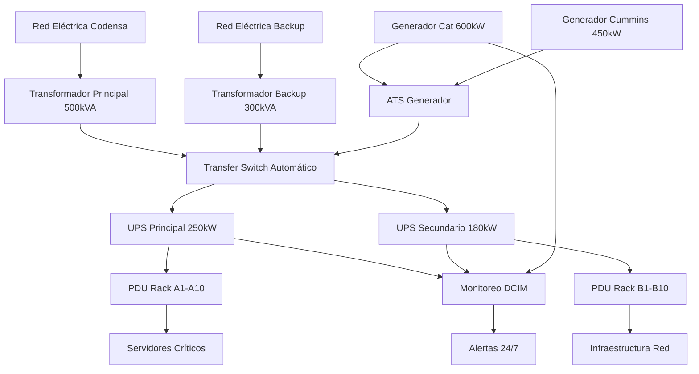

<Callout title="¿Quieres aprender más?">
  Descarga el [Kit de Ciberseguridad](https://divisioncero.com/home/kit-inicial-ciberseguridad?utm_source=docs.divisioncero.com/docs/kudo).
</Callout>

## Información del Documento

| Campo | Valor |
|-------|-------|
| **Versión** | v1.3.0 |
| **Fecha de Creación** | 2024-01-20 |
| **Última Actualización** | 2024-03-15 |
| **Clasificación** | Confidencial |
| **Propietario** | Director de Infraestructura - DivisionCero |
| **Audiencia** | Equipos de Infraestructura, Facilities y Operaciones |

## 1. Objetivo y Alcance

### 1.1 Objetivo
Garantizar la continuidad operacional de los servicios críticos de DivisionCero mediante la implementación de sistemas de respaldo eléctrico, control ambiental y protección contra incendios, minimizando el impacto de interrupciones en la infraestructura física.

### 1.2 Alcance
Este plan aplica a:
- **Data Center principal** (Bogotá - Zona Rosa)
- **Data Center secundario** (Medellín - El Poblado)
- **Oficinas corporativas** con equipos críticos
- **Servicios cloud híbridos** con componentes on-premise
- **Infraestructura de red** y telecomunicaciones
- **Sistemas de monitoreo** y seguridad física

## 2. Marco Normativo y Estándares

### 2.1 Estándares de Referencia
- **ISO 27001:2022** - A.11.2.1 (Suministro de energía)
- **NIST SP 800-53** - PE-9, PE-10, PE-11 (Physical Environmental Protection)
- **TIA-942** - Estándar para infraestructura de centros de datos
- **ASHRAE TC 9.9** - Directrices ambientales para centros de datos
- **NFPA 75** - Protección contra incendios en equipos TI

### 2.2 Regulaciones Colombianas
- **RETIE** - Reglamento Técnico de Instalaciones Eléctricas
- **NTC 2050** - Código Eléctrico Colombiano
- **Resolución CREG** - Calidad del servicio eléctrico

## 3. Inventario de Infraestructura Crítica

### 3.1 Data Center Principal (Bogotá)

#### 3.1.1 Sistemas Eléctricos
```yaml
# Configuración eléctrica DC principal
datacenter_bogota:
  ubicacion: "Zona Rosa, Bogotá"
  tier_level: "Tier III"
  
  alimentacion_principal:
    proveedor: "Codensa"
    voltaje: "440V trifásico"
    capacidad: "500 kVA"
    acometida: "Doble acometida independiente"
  
  ups_sistemas:
    - modelo: "APC Symmetra PX 250kW"
      capacidad: "250 kVA"
      autonomia: "15 minutos carga completa"
      baterias: "VRLA 12V 100Ah x48"
      ubicacion: "Sala UPS Piso 1"
    
    - modelo: "Schneider Electric Galaxy VM 180kW"
      capacidad: "180 kVA"
      autonomia: "20 minutos carga parcial"
      baterias: "Litio-Ion modular"
      ubicacion: "Sala UPS Piso 2"
  
  generadores:
    principal:
      modelo: "Caterpillar C32 600kW"
      combustible: "ACPM"
      tanque_principal: "2000 litros"
      tanque_diario: "500 litros"
      tiempo_arranque: "10 segundos"
      autonomia: "72 horas carga completa"
    
    respaldo:
      modelo: "Cummins C400 D5 450kW"
      combustible: "Gas natural + ACPM"
      autonomia: "Ilimitada (gas) / 48h (ACPM)"
```

#### 3.1.2 Sistemas HVAC
```yaml
# Control ambiental DC principal
hvac_bogota:
  diseño: "N+1 redundancia"
  
  unidades_precision:
    - marca: "Schneider APC InRow"
      modelo: "ACRC301"
      capacidad: "30 kW enfriamiento"
      flujo_aire: "4200 CFM"
      redundancia: "Hot-standby"
      cantidad: 6
  
  parametros_operacion:
    temperatura:
      objetivo: "22°C ±2°C"
      alarma_alta: "26°C"
      alarma_critica: "30°C"
    
    humedad:
      objetivo: "45% ±5% RH"
      alarma_baja: "35% RH"
      alarma_alta: "60% RH"
  
  monitoreo:
    sensores: "Modbus RTU"
    puntos_medicion: 24
    sistema_bms: "Honeywell EBI R500"
```

### 3.2 Data Center Secundario (Medellín)

#### 3.2.1 Configuración Simplificada
```yaml
datacenter_medellin:
  ubicacion: "El Poblado, Medellín"
  tier_level: "Tier II"
  
  alimentacion:
    proveedor: "EPM"
    ups_principal: "Eaton 9395 150kW"
    generador: "Perkins 200kW"
    autonomia_total: "24 horas"
  
  hvac:
    unidades: "Liebert Precision 3"
    redundancia: "N+0"
    capacidad_total: "60 kW"
```

## 4. Arquitectura de Continuidad Eléctrica

### 4.1 Topología de Alimentación



### 4.2 Niveles de Alimentación

| Nivel | Descripción | Tiempo Respuesta | Autonomía |
|-------|-------------|------------------|-----------|
| **Nivel 1** | Red eléctrica principal | Continuo | Ilimitado |
| **Nivel 2** | Red eléctrica backup | < 100ms | Ilimitado |
| **Nivel 3** | UPS sistemas críticos | 0ms | 15-20 min |
| **Nivel 4** | Generador principal | < 10s | 72 horas |
| **Nivel 5** | Generador backup | < 15s | 48 horas |
| **Nivel 6** | Shutdown controlado | < 5 min | N/A |

## 5. Procedimientos de Contingencia Eléctrica

### 5.1 Escenarios de Falla

#### 5.1.1 Corte Parcial Red Eléctrica (< 2 horas)
```bash
#!/bin/bash
# Procedimiento automatizado - Corte parcial
# Script: /opt/dcops/scripts/power-outage-partial.sh

DATETIME=$(date '+%Y-%m-%d %H:%M:%S')
LOG_FILE="/var/log/dcops/power-events.log"

echo "[$DATETIME] EVENTO: Corte parcial detectado" >> $LOG_FILE

# 1. Verificar estado UPS
/opt/dcops/scripts/check-ups-status.sh

# 2. Activar generadores en standby
echo "Activando generadores en modo standby..."
/opt/dcops/scripts/generator-standby.sh

# 3. Notificar equipos
curl -X POST "$SLACK_WEBHOOK_CRITICAL" \
  -H 'Content-type: application/json' \
  --data "{\"text\":\"⚡ ALERTA: Corte eléctrico parcial detectado. UPS activos. Generadores en standby.\"}"

# 4. Monitoreo continuo
/opt/dcops/scripts/monitor-power-recovery.sh &

echo "[$DATETIME] Procedimiento corte parcial ejecutado" >> $LOG_FILE
```

#### 5.1.2 Corte Total Red Eléctrica (> 2 horas)
```python
#!/usr/bin/env python3
"""
Procedimiento automatizado - Corte total prolongado
Script: /opt/dcops/scripts/power-outage-total.py
"""

import subprocess
import time
import json
import logging
from datetime import datetime

# Configuración logging
logging.basicConfig(
    filename='/var/log/dcops/power-critical.log',
    level=logging.INFO,
    format='%(asctime)s - %(levelname)s - %(message)s'
)

def ejecutar_corte_total():
    """Ejecuta procedimiento de corte total"""
    
    logging.info("INICIANDO: Procedimiento corte total eléctrico")
    
    # 1. Verificar autonomía restante UPS
    autonomia_ups = verificar_autonomia_ups()
    
    if autonomia_ups < 600:  # Menos de 10 minutos
        logging.critical(f"CRÍTICO: Autonomía UPS restante: {autonomia_ups/60:.1f} min")
        iniciar_shutdown_escalonado()
    
    # 2. Arranque automático generadores
    logging.info("Iniciando arranque generadores principales")
    
    resultado_gen1 = subprocess.run([
        '/opt/dcops/scripts/start-generator.sh', 'principal'
    ], capture_output=True, text=True)
    
    if resultado_gen1.returncode != 0:
        logging.error("FALLO: Generador principal no arrancó")
        
        # Intentar generador backup
        resultado_gen2 = subprocess.run([
            '/opt/dcops/scripts/start-generator.sh', 'backup'
        ], capture_output=True, text=True)
        
        if resultado_gen2.returncode != 0:
            logging.critical("CRÍTICO: Ambos generadores fallaron")
            notificar_emergencia()
            iniciar_shutdown_emergencia()
    
    # 3. Verificar transferencia de carga
    time.sleep(30)  # Esperar estabilización
    verificar_transferencia_carga()
    
    # 4. Notificar estado
    notificar_estado_generadores()

def verificar_autonomia_ups():
    """Retorna autonomía restante UPS en segundos"""
    try:
        result = subprocess.run([
            'apcaccess', 'status'
        ], capture_output=True, text=True)
        
        # Parsear salida para obtener TIMELEFT
        for line in result.stdout.split('\n'):
            if 'TIMELEFT' in line:
                tiempo_str = line.split(':')[1].strip().split()[0]
                return float(tiempo_str) * 60  # Convertir a segundos
        
        return 0
    except:
        logging.error("Error verificando autonomía UPS")
        return 0

def iniciar_shutdown_escalonado():
    """Inicia shutdown escalonado de servicios"""
    
    logging.warning("INICIANDO: Shutdown escalonado de servicios")
    
    # Servicios no críticos (inmediato)
    servicios_no_criticos = [
        'desarrollo', 'testing', 'analytics-batch'
    ]
    
    for servicio in servicios_no_criticos:
        subprocess.run([
            '/opt/dcops/scripts/shutdown-service.sh', servicio
        ])
        logging.info(f"Shutdown: {servicio}")
    
    time.sleep(120)  # Esperar 2 minutos
    
    # Servicios secundarios
    servicios_secundarios = [
        'backup-systems', 'monitoring-secundario'
    ]
    
    for servicio in servicios_secundarios:
        subprocess.run([
            '/opt/dcops/scripts/shutdown-service.sh', servicio
        ])
        logging.info(f"Shutdown: {servicio}")
    
    time.sleep(180)  # Esperar 3 minutos
    
    # Solo mantener servicios críticos
    logging.warning("Manteniendo solo servicios críticos activos")

def notificar_emergencia():
    """Notifica emergencia eléctrica crítica"""
    
    mensaje = {
        "text": "🚨 EMERGENCIA CRÍTICA: Fallo total sistema eléctrico",
        "attachments": [
            {
                "color": "danger",
                "fields": [
                    {
                        "title": "Estado",
                        "value": "Generadores no disponibles",
                        "short": True
                    },
                    {
                        "title": "Acción",
                        "value": "Shutdown de emergencia iniciado",
                        "short": True
                    }
                ]
            }
        ]
    }
    
    # Slack
    subprocess.run([
        'curl', '-X', 'POST', 'SLACK_WEBHOOK_EMERGENCY',
        '-H', 'Content-type: application/json',
        '--data', json.dumps(mensaje)
    ])
    
    # SMS al equipo de guardia
    subprocess.run([
        '/opt/dcops/scripts/send-emergency-sms.sh',
        'FALLO_ELECTRICO_CRITICO'
    ])

if __name__ == "__main__":
    ejecutar_corte_total()
```

### 5.2 Matriz de Decisión por Escenario

| Escenario | Duración Estimada | Acción Automática | Acción Manual |
|-----------|-------------------|-------------------|---------------|
| **Micro-corte** | < 30 segundos | UPS mantiene servicios | Monitoreo |
| **Corte breve** | 30s - 10 min | UPS + Alerta | Verificar generadores |
| **Corte medio** | 10 min - 2h | Arranque generadores | Contactar proveedor |
| **Corte prolongado** | 2h - 8h | Modo conservación | Gestión combustible |
| **Corte crítico** | > 8h | Shutdown escalonado | Activar DR |

## 6. Control Ambiental y HVAC

### 6.1 Parámetros Ambientales Críticos

#### 6.1.1 Temperatura
```yaml
temperatura_control:
  zonas_criticas:
    sala_servidores:
      temperatura_objetivo: 22°C
      tolerancia: ±2°C
      alarma_preventiva: 25°C
      alarma_critica: 28°C
      shutdown_automatico: 35°C
    
    sala_ups:
      temperatura_objetivo: 24°C
      tolerancia: ±3°C
      ventilacion_forzada: 30°C
    
    sala_generadores:
      temperatura_ambiente: "Ambiente + 10°C max"
      ventilacion_activa: "Permanente durante operación"
  
  monitoreo:
    sensores_cantidad: 24
    frecuencia_lectura: "30 segundos"
    retencion_datos: "2 años"
```

#### 6.1.2 Humedad Relativa
```yaml
humedad_control:
  parametros_ideales:
    humedad_objetivo: 45%
    rango_operacion: "40% - 50%"
    alarma_baja: 35%
    alarma_alta: 60%
  
  sistemas_control:
    humidificadores:
      modelo: "DriSteem STS"
      capacidad: "50 kg/h"
      control: "Proporcional modulante"
    
    deshumidificadores:
      activacion_automatica: 55%
      capacidad: "30 litros/día"
```

### 6.2 Sistemas de Climatización

#### 6.2.1 Configuración HVAC Principal
```javascript
// Configuración sistema HVAC inteligente
// Archivo: /etc/hvac/dc-climate-control.js

const hvacConfig = {
  unidades: [
    {
      id: 'HVAC-01',
      zona: 'Rack-A1-A5',
      tipo: 'precision_cooling',
      capacidad: '30kW',
      estado: 'activo',
      sensores: ['temp-01', 'temp-02', 'hum-01'],
      control: {
        modo: 'automatico',
        temperatura_set: 22,
        algoritmo: 'PID_optimizado'
      }
    },
    {
      id: 'HVAC-02',
      zona: 'Rack-A6-A10',
      tipo: 'precision_cooling',
      capacidad: '30kW',
      estado: 'standby',
      sensores: ['temp-03', 'temp-04', 'hum-02']
    }
  ],
  
  redundancia: {
    tipo: 'N+1',
    conmutacion_automatica: true,
    tiempo_respuesta: '< 60 segundos'
  },
  
  emergencia: {
    temperatura_critica: 35,
    accion: 'shutdown_escalonado',
    notificacion: 'inmediata'
  }
};

// Sistema de monitoreo continuo
function monitorearAmbiente() {
  const sensores = obtenerLecturasSensores();
  
  sensores.forEach(sensor => {
    if (sensor.temperatura > hvacConfig.emergencia.temperatura_critica) {
      ejecutarProcedimientoEmergencia(sensor);
    }
    
    if (sensor.humedad < 35 || sensor.humedad > 60) {
      ajustarControlHumedad(sensor);
    }
  });
  
  // Log cada 5 minutos
  if (Date.now() % 300000 < 1000) {
    registrarEstadoAmbiental(sensores);
  }
}

// Optimización energética
function optimizarConsumoHVAC() {
  const cargaActual = obtenerCargaServidores();
  const temperaturaExterior = obtenerTemperaturaExterior();
  
  // Free cooling cuando sea posible
  if (temperaturaExterior < 18 && cargaActual < 60) {
    activarFreeCooling();
  }
  
  // Ajustar velocidad ventiladores según carga
  ajustarVelocidadVentiladores(cargaActual);
}

setInterval(monitorearAmbiente, 30000); // Cada 30 segundos
setInterval(optimizarConsumoHVAC, 300000); // Cada 5 minutos
```

## 7. Protección Contra Incendios

### 7.1 Sistemas de Detección

#### 7.1.1 Detectores y Sensores
```yaml
deteccion_incendios:
  sistema_principal:
    marca: "Honeywell NOTIFIER"
    modelo: "NFS2-3030"
    zonas: 16
    direccionables: true
  
  detectores:
    humo_optico:
      modelo: "FSP-851A"
      cantidad: 32
      ubicacion: "Techo, bajo piso elevado"
      sensibilidad: "Alta sensibilidad"
    
    temperatura:
      modelo: "FST-851A"
      cantidad: 16
      punto_alarma: "58°C"
      ubicacion: "Racks críticos"
    
    gas:
      tipo: "Detector CO"
      ubicacion: "Sala generadores"
      alarma_concentracion: "50 ppm"
  
  aspiracion:
    marca: "Xtralis VESDA"
    modelo: "VSP-500"
    cobertura: "Sala servidores principal"
    tuberia_muestreo: "Sistema Classe A"
    niveles_alarma:
      alerta: "0.005% obs/m"
      accion: "0.02% obs/m"
      incendio1: "0.05% obs/m"
      incendio2: "0.1% obs/m"
```

### 7.2 Sistemas de Supresión

#### 7.2.1 Agente Limpio FM-200
```yaml
supresion_fm200:
  sistema: "Fike Chemetron"
  agente: "FM-200 (HFC-227ea)"
  
  cilindros:
    cantidad: 8
    capacidad_individual: "180 kg"
    presion_trabajo: "42 bar"
    ubicacion: "Sala agente limpio"
  
  concentracion_diseño: "7.5%"
  tiempo_descarga: "10 segundos"
  tiempo_retencion: "10 minutos"
  
  activacion:
    detectores_cruzados: "Requerido"
    retardo_liberacion: "30 segundos"
    abort_manual: "Disponible 30s"
  
  areas_protegidas:
    - "Sala servidores principal (280 m³)"
    - "Sala UPS (150 m³)"
    - "Sala networking (80 m³)"
```

### 7.3 Procedimientos de Emergencia

#### 7.3.1 Detección de Humo/Fuego
```bash
#!/bin/bash
# Procedimiento automatizado detección incendio
# Script: /opt/safety/scripts/fire-detection.sh

ALERT_LEVEL=$1  # SMOKE, FIRE1, FIRE2
ZONE=$2         # Zona detectada
DATETIME=$(date '+%Y-%m-%d %H:%M:%S')

case $ALERT_LEVEL in
  "SMOKE")
    echo "[$DATETIME] ALERTA HUMO - Zona: $ZONE"
    
    # Investigación inmediata
    /opt/safety/scripts/activate-cctv-zone.sh $ZONE
    /opt/safety/scripts/notify-security-team.sh "SMOKE_DETECTION" $ZONE
    
    # Aumentar sensibilidad detectores
    /opt/safety/scripts/increase-detector-sensitivity.sh $ZONE
    ;;
    
  "FIRE1")
    echo "[$DATETIME] ALERTA INCENDIO NIVEL 1 - Zona: $ZONE"
    
    # Pre-alarma
    /opt/safety/scripts/pre-alarm-sequence.sh $ZONE
    
    # Notificar bomberos (pre-aviso)
    /opt/safety/scripts/notify-fire-department.sh "PRE_ALARM" $ZONE
    
    # Preparar evacuación
    /opt/safety/scripts/prepare-evacuation.sh $ZONE
    ;;
    
  "FIRE2")
    echo "[$DATETIME] EMERGENCIA INCENDIO - EVACUACIÓN INMEDIATA"
    
    # Activar alarma general
    /opt/safety/scripts/activate-general-alarm.sh
    
    # Shutdown sistemas zona afectada
    /opt/safety/scripts/emergency-shutdown-zone.sh $ZONE
    
    # Activar supresión FM-200 (si procede)
    if [[ "$ZONE" == "SERVER_ROOM" ]]; then
      /opt/safety/scripts/activate-fm200.sh $ZONE
    fi
    
    # Llamada automática bomberos
    /opt/safety/scripts/emergency-call-fire-dept.sh $ZONE
    
    # Notificación múltiple
    /opt/safety/scripts/mass-notification.sh "FIRE_EMERGENCY" $ZONE
    ;;
esac

# Log del evento
echo "[$DATETIME] Procedimiento $ALERT_LEVEL ejecutado para zona $ZONE" >> /var/log/safety/fire-events.log
```

## 8. Monitoreo y Sistemas DCIM

### 8.1 Plataforma de Monitoreo Integrado

#### 8.1.1 Stack de Monitoreo
```yaml
dcim_stack:
  plataforma_principal:
    software: "Schneider EcoStruxure IT Expert"
    version: "2024.1"
    funciones:
      - "Monitoreo energético tiempo real"
      - "Gestión capacidad y planificación"
      - "Alertas predictivas"
      - "Reportes compliance"
  
  colectores_datos:
    - tipo: "Modbus RTU/TCP"
      dispositivos: "UPS, PDU, HVAC"
      frecuencia: "15 segundos"
    
    - tipo: "SNMP v3"
      dispositivos: "Switches, routers"
      frecuencia: "30 segundos"
    
    - tipo: "API REST"
      dispositivos: "Sistemas cloud"
      frecuencia: "60 segundos"
  
  almacenamiento_metricas:
    base_datos: "InfluxDB"
    retencion:
      raw_data: "30 días"
      aggregated_1h: "1 año"
      aggregated_1d: "5 años"
```

#### 8.1.2 Dashboard Principal
```javascript
// Configuración dashboard DCIM
// Archivo: /opt/dcim/config/dashboard-config.js

const dashboardConfig = {
  metricas_criticas: [
    {
      nombre: 'PUE (Power Usage Effectiveness)',
      query: 'total_facility_power / it_equipment_power',
      objetivo: 1.4,
      alerta_amarilla: 1.6,
      alerta_roja: 1.8,
      unidad: 'ratio'
    },
    {
      nombre: 'Carga UPS Principal',
      query: 'ups_load_percentage',
      objetivo: 60,
      alerta_amarilla: 80,
      alerta_roja: 90,
      unidad: '%'
    },
    {
      nombre: 'Temperatura Promedio Rack',
      query: 'avg(rack_temperature)',
      objetivo: 22,
      alerta_amarilla: 25,
      alerta_roja: 28,
      unidad: '°C'
    }
  ],
  
  widgets: [
    {
      tipo: 'gauge',
      metrica: 'ups_battery_capacity',
      titulo: 'Capacidad Baterías UPS',
      rango: [0, 100],
      unidad: '%'
    },
    {
      tipo: 'timeseries',
      metricas: ['power_consumption', 'cooling_power'],
      titulo: 'Consumo Energético',
      periodo: '24h'
    },
    {
      tipo: 'heatmap',
      metrica: 'rack_temperature',
      titulo: 'Mapa Térmico Data Center',
      layout: 'floor_plan'
    }
  ],
  
  alertas_tiempo_real: {
    canales: ['slack', 'email', 'sms'],
    escalamiento: {
      nivel1: '5 minutos',
      nivel2: '15 minutos',
      nivel3: '30 minutos'
    }
  }
};

// Funciones de monitoreo
function calcularPUE() {
  const potenciaTotal = obtenerPotenciaFacilidad();
  const potenciaIT = obtenerPotenciaEquiposIT();
  
  const pue = potenciaTotal / potenciaIT;
  
  if (pue > 1.8) {
    enviarAlerta('PUE_CRITICO', `PUE actual: ${pue.toFixed(2)}`);
  }
  
  return pue;
}

function verificarRedundancia() {
  const estadoUPS = verificarEstadoUPS();
  const estadoHVAC = verificarEstadoHVAC();
  const estadoGeneradores = verificarEstadoGeneradores();
  
  const redundanciaOK = 
    estadoUPS.redundancia && 
    estadoHVAC.redundancia && 
    estadoGeneradores.disponibilidad;
  
  if (!redundanciaOK) {
    enviarAlerta('REDUNDANCIA_COMPROMETIDA', {
      ups: estadoUPS,
      hvac: estadoHVAC,
      generadores: estadoGeneradores
    });
  }
}

// Ejecutar verificaciones cada minuto
setInterval(() => {
  calcularPUE();
  verificarRedundancia();
}, 60000);
```

### 8.2 Alertas y Notificaciones

#### 8.2.1 Matriz de Alertas
| Tipo Alerta | Severidad | Tiempo Respuesta | Canal | Escalamiento |
|--------------|-----------|------------------|-------|--------------|
| **Corte eléctrico** | Crítica | Inmediato | Llamada + SMS | CISO + CTO |
| **Temperatura alta** | Alta | 5 minutos | Slack + Email | Facilities |
| **UPS baterías bajas** | Media | 10 minutos | Email | Infraestructura |
| **PUE elevado** | Baja | 30 minutos | Dashboard | Optimización |

#### 8.2.2 Configuración Alertas
```python
#!/usr/bin/env python3
"""
Sistema de alertas DCIM integrado
Archivo: /opt/dcim/alerting/alert-manager.py
"""

import json
import requests
import smtplib
from datetime import datetime
from email.mime.text import MimeText

class AlertManager:
    def __init__(self):
        self.config = self.cargar_configuracion()
        self.canales = {
            'slack': self.enviar_slack,
            'email': self.enviar_email,
            'sms': self.enviar_sms,
            'llamada': self.realizar_llamada
        }
    
    def procesar_alerta(self, metrica, valor, severidad):
        """Procesa y enruta alertas según severidad"""
        
        alerta = {
            'timestamp': datetime.now().isoformat(),
            'metrica': metrica,
            'valor': valor,
            'severidad': severidad,
            'datacenter': 'Bogotá-Principal'
        }
        
        # Determinar canales según severidad
        if severidad == 'CRITICA':
            canales = ['llamada', 'sms', 'slack']
            self.escalar_inmediato(alerta)
        elif severidad == 'ALTA':
            canales = ['slack', 'email']
        else:
            canales = ['email']
        
        # Enviar por todos los canales
        for canal in canales:
            try:
                self.canales[canal](alerta)
            except Exception as e:
                print(f"Error enviando por {canal}: {e}")
    
    def enviar_slack(self, alerta):
        """Envía alerta a Slack"""
        color = {
            'CRITICA': 'danger',
            'ALTA': 'warning',
            'MEDIA': 'good'
        }.get(alerta['severidad'], 'good')
        
        mensaje = {
            "text": f"🚨 Alerta {alerta['severidad']} - {alerta['metrica']}",
            "attachments": [
                {
                    "color": color,
                    "fields": [
                        {
                            "title": "Métrica",
                            "value": alerta['metrica'],
                            "short": True
                        },
                        {
                            "title": "Valor",
                            "value": str(alerta['valor']),
                            "short": True
                        },
                        {
                            "title": "Data Center",
                            "value": alerta['datacenter'],
                            "short": True
                        },
                        {
                            "title": "Timestamp",
                            "value": alerta['timestamp'],
                            "short": True
                        }
                    ]
                }
            ]
        }
        
        webhook_url = self.config['slack']['webhook_critico']
        requests.post(webhook_url, json=mensaje)
    
    def escalar_inmediato(self, alerta):
        """Escalamiento inmediato para alertas críticas"""
        # Llamada automática al equipo de guardia
        numeros_guardia = self.config['escalamiento']['guardia_24x7']
        
        for numero in numeros_guardia:
            self.realizar_llamada_automatica(numero, alerta)
        
        # Notificar a directivos
        if alerta['metrica'] in ['corte_electrico', 'incendio_detectado']:
            self.notificar_directivos(alerta)

# Uso del sistema
if __name__ == "__main__":
    alert_manager = AlertManager()
    
    # Ejemplo: Temperatura crítica detectada
    alert_manager.procesar_alerta(
        metrica='temperatura_servidor',
        valor=32.5,
        severidad='ALTA'
    )
```

## 9. Mantenimiento Preventivo

### 9.1 Cronograma de Mantenimiento

#### 9.1.1 Sistemas Eléctricos
```yaml
mantenimiento_electrico:
  ups_sistemas:
    frecuencia: "Trimestral"
    actividades:
      - "Verificación capacidad baterías"
      - "Limpieza contactos y conexiones"
      - "Prueba transferencia automática"
      - "Calibración voltajes y frecuencias"
      - "Actualización firmware"
    
    mantenimiento_mayor:
      frecuencia: "Anual"
      actividades:
        - "Reemplazo baterías (según ciclos)"
        - "Revisión sistema ventilación"
        - "Prueba carga completa"
        - "Termografía conexiones"
  
  generadores:
    frecuencia: "Mensual"
    actividades:
      - "Prueba arranque semanal (15 min)"
      - "Verificación niveles combustible"
      - "Inspección visual fugas"
      - "Prueba transferencia carga"
    
    mantenimiento_mayor:
      frecuencia: "500 horas operación"
      actividades:
        - "Cambio aceite y filtros"
        - "Revisión sistema refrigeración"
        - "Calibración reguladores"
        - "Prueba carga escalonada"
```

#### 9.1.2 Sistemas HVAC
```yaml
mantenimiento_hvac:
  unidades_precision:
    frecuencia: "Mensual"
    actividades:
      - "Limpieza filtros aire"
      - "Verificación caudales"
      - "Calibración sensores"
      - "Inspección condensadores"
    
    frecuencia_trimestral:
      - "Limpieza evaporadores"
      - "Verificación refrigerante"
      - "Prueba sistemas emergencia"
      - "Actualización set points"
  
  sistema_deteccion_incendios:
    frecuencia: "Semestral"
    actividades:
      - "Prueba funcional detectores"
      - "Calibración sensores humo"
      - "Verificación cableado"
      - "Prueba comunicaciones"
    
    frecuencia_anual:
      - "Prueba descarga FM-200"
      - "Recertificación sistema"
      - "Entrenamiento personal"
```

### 9.2 Scripts de Verificación Automática

#### 9.2.1 Verificación Sistemas Críticos
```bash
#!/bin/bash
# Script verificación diaria sistemas críticos
# Archivo: /opt/maintenance/scripts/daily-check.sh

DATE=$(date '+%Y-%m-%d')
REPORT_FILE="/var/log/maintenance/daily-check-$DATE.log"

echo "=== VERIFICACIÓN DIARIA SISTEMAS CRÍTICOS ===" > $REPORT_FILE
echo "Fecha: $DATE" >> $REPORT_FILE
echo "=========================================" >> $REPORT_FILE

# 1. Verificar estado UPS
echo "" >> $REPORT_FILE
echo "1. ESTADO UPS:" >> $REPORT_FILE
apcaccess status | grep -E "(STATUS|LOADPCT|BCHARGE|TIMELEFT)" >> $REPORT_FILE

# 2. Verificar generadores
echo "" >> $REPORT_FILE
echo "2. ESTADO GENERADORES:" >> $REPORT_FILE
/opt/maintenance/scripts/check-generators.sh >> $REPORT_FILE

# 3. Verificar temperatura ambiente
echo "" >> $REPORT_FILE
echo "3. TEMPERATURA AMBIENTE:" >> $REPORT_FILE
snmpwalk -v3 -u dcuser -A authpass -a SHA -X privpass -x AES \
  192.168.100.10 1.3.6.1.4.1.318.1.1.2.2.1.0 >> $REPORT_FILE

# 4. Verificar humedad
echo "" >> $REPORT_FILE
echo "4. HUMEDAD RELATIVA:" >> $REPORT_FILE
snmpwalk -v3 -u dcuser -A authpass -a SHA -X privpass -x AES \
  192.168.100.10 1.3.6.1.4.1.318.1.1.2.2.2.0 >> $REPORT_FILE

# 5. Verificar sistema detección incendios
echo "" >> $REPORT_FILE
echo "5. SISTEMA DETECCIÓN INCENDIOS:" >> $REPORT_FILE
/opt/maintenance/scripts/check-fire-system.sh >> $REPORT_FILE

# 6. Generar resumen
echo "" >> $REPORT_FILE
echo "6. RESUMEN ESTADO:" >> $REPORT_FILE
/opt/maintenance/scripts/generate-summary.sh >> $REPORT_FILE

# Enviar reporte si hay anomalías
if grep -q "ERROR\|CRITICAL\|FAIL" $REPORT_FILE; then
    /opt/maintenance/scripts/send-anomaly-report.sh $REPORT_FILE
fi

echo "Verificación completada. Reporte: $REPORT_FILE"
```

## 10. Planes de Contingencia y Recuperación

### 10.1 Escenarios de Desastre

#### 10.1.1 Falla Múltiple Sistemas
```yaml
contingencia_falla_multiple:
  escenario: "UPS + Generador Principal fallan simultáneamente"
  
  tiempo_critico: "5 minutos"
  
  acciones_inmediatas:
    minuto_0:
      - "Activar generador backup automáticamente"
      - "Notificar emergencia a equipo guardia"
      - "Iniciar shutdown servicios no críticos"
    
    minuto_2:
      - "Verificar arranque generador backup"
      - "Si falla: iniciar shutdown general escalonado"
      - "Contactar proveedor eléctrico"
    
    minuto_5:
      - "Si no hay estabilización: activar plan DR"
      - "Transferir servicios críticos a DC secundario"
      - "Declarar contingencia mayor"
  
  plan_recuperacion:
    prioridad_1: "Restaurar alimentación eléctrica"
    prioridad_2: "Verificar integridad datos"
    prioridad_3: "Restaurar servicios por criticidad"
    prioridad_4: "Análisis post-incidente"
```

### 10.2 Procedimientos de Recuperación

#### 10.2.1 Restauración Post-Incidente
```python
#!/usr/bin/env python3
"""
Procedimiento de recuperación post-incidente eléctrico
Archivo: /opt/recovery/scripts/power-recovery.py
"""

import subprocess
import time
import logging
from datetime import datetime

class PowerRecoveryManager:
    def __init__(self):
        self.setup_logging()
        self.fases_recuperacion = [
            'verificar_alimentacion',
            'restaurar_ups',
            'verificar_hvac',
            'restaurar_servicios_criticos',
            'restaurar_servicios_secundarios',
            'verificar_integridad',
            'normalizar_operacion'
        ]
    
    def ejecutar_recuperacion(self):
        """Ejecuta secuencia completa de recuperación"""
        
        logging.info("INICIANDO: Procedimiento recuperación eléctrica")
        
        for fase in self.fases_recuperacion:
            logging.info(f"Ejecutando fase: {fase}")
            
            resultado = getattr(self, fase)()
            
            if not resultado['exito']:
                logging.error(f"FALLO en fase {fase}: {resultado['error']}")
                self.manejar_fallo_recuperacion(fase, resultado)
                break
            else:
                logging.info(f"COMPLETADO: {fase}")
                time.sleep(30)  # Pausa entre fases
        
        self.generar_reporte_recuperacion()
    
    def verificar_alimentacion(self):
        """Fase 1: Verificar estabilidad alimentación eléctrica"""
        try:
            # Verificar voltaje y frecuencia estables
            voltaje = self.obtener_voltaje_red()
            frecuencia = self.obtener_frecuencia_red()
            
            if 210 <= voltaje <= 230 and 59.5 <= frecuencia <= 60.5:
                return {'exito': True, 'detalle': 'Alimentación estable'}
            else:
                return {
                    'exito': False, 
                    'error': f'Parámetros fuera de rango: V={voltaje}, F={frecuencia}'
                }
        
        except Exception as e:
            return {'exito': False, 'error': str(e)}
    
    def restaurar_ups(self):
        """Fase 2: Restaurar y sincronizar sistemas UPS"""
        try:
            # Verificar que UPS estén en modo normal
            estado_ups1 = self.verificar_ups('UPS-01')
            estado_ups2 = self.verificar_ups('UPS-02')
            
            if estado_ups1['modo'] == 'online' and estado_ups2['modo'] == 'online':
                # Sincronizar cargas si es necesario
                self.sincronizar_cargas_ups()
                return {'exito': True, 'detalle': 'UPS operando normalmente'}
            else:
                return {'exito': False, 'error': 'UPS no en modo normal'}
        
        except Exception as e:
            return {'exito': False, 'error': str(e)}
    
    def restaurar_servicios_criticos(self):
        """Fase 4: Restaurar servicios críticos por prioridad"""
        servicios_criticos = [
            'domain-controllers',
            'network-core',
            'database-primary',
            'api-gateway',
            'monitoring-systems'
        ]
        
        for servicio in servicios_criticos:
            logging.info(f"Restaurando servicio: {servicio}")
            
            resultado = subprocess.run([
                '/opt/recovery/scripts/start-service.sh', servicio
            ], capture_output=True, text=True)
            
            if resultado.returncode != 0:
                return {
                    'exito': False, 
                    'error': f'Fallo restaurando {servicio}: {resultado.stderr}'
                }
            
            # Verificar que el servicio esté funcionando
            time.sleep(60)
            if not self.verificar_servicio_healthy(servicio):
                return {
                    'exito': False,
                    'error': f'Servicio {servicio} no responde correctamente'
                }
        
        return {'exito': True, 'detalle': 'Servicios críticos restaurados'}
    
    def generar_reporte_recuperacion(self):
        """Genera reporte completo del proceso de recuperación"""
        
        reporte = {
            'timestamp': datetime.now().isoformat(),
            'duracion_total': self.calcular_duracion_recuperacion(),
            'servicios_restaurados': self.obtener_servicios_activos(),
            'metricas_post_recuperacion': {
                'pue': self.calcular_pue(),
                'temperatura_promedio': self.obtener_temperatura_promedio(),
                'carga_ups': self.obtener_carga_ups_promedio()
            },
            'acciones_pendientes': self.identificar_acciones_pendientes()
        }
        
        # Guardar reporte
        with open(f'/var/log/recovery/recovery-report-{datetime.now().strftime("%Y%m%d-%H%M")}.json', 'w') as f:
            json.dump(reporte, f, indent=2)
        
        # Notificar completion
        self.notificar_recuperacion_completada(reporte)

if __name__ == "__main__":
    recovery_manager = PowerRecoveryManager()
    recovery_manager.ejecutar_recuperacion()
```

## 11. Métricas y KPIs

### 11.1 Indicadores de Disponibilidad

#### 11.1.1 KPIs Eléctricos
```yaml
kpis_electricos:
  disponibilidad_electrica:
    objetivo: "99.99%"
    calculo: "(tiempo_total - tiempo_interrupciones) / tiempo_total * 100"
    medicion: "Mensual"
  
  mtbf_ups:
    objetivo: "> 8760 horas"
    descripcion: "Tiempo promedio entre fallas UPS"
    tracking: "Continuo"
  
  mttr_electrico:
    objetivo: "< 15 minutos"
    descripcion: "Tiempo promedio reparación incidentes eléctricos"
    tracking: "Por incidente"
  
  autonomia_promedio:
    objetivo: "> 15 minutos"
    descripcion: "Autonomía promedio sistemas UPS bajo carga"
    medicion: "Trimestral"
```

#### 11.1.2 KPIs Ambientales
```yaml
kpis_ambientales:
  pue_datacenter:
    objetivo: "< 1.4"
    calculo: "potencia_total / potencia_it"
    medicion: "Continua"
  
  efectividad_enfriamiento:
    objetivo: "> 90%"
    calculo: "capacidad_enfriamiento_utilizada / capacidad_total"
    medicion: "Mensual"
  
  estabilidad_temperatura:
    objetivo: "22°C ±2°C en 95% del tiempo"
    tracking: "Continuo"
  
  tiempo_respuesta_hvac:
    objetivo: "< 2 minutos"
    descripcion: "Tiempo respuesta ante variaciones temperatura"
    medicion: "Por evento"
```

### 11.2 Dashboard Ejecutivo

#### 11.2.1 Métricas Tiempo Real
```javascript
// Dashboard ejecutivo métricas críticas
// Archivo: /opt/dcim/dashboard/executive-dashboard.js

const executiveDashboard = {
  metricas_criticas: {
    disponibilidad_mes_actual: {
      valor: 99.97,
      objetivo: 99.99,
      estado: 'amarillo',
      tendencia: 'estable'
    },
    
    pue_tiempo_real: {
      valor: 1.38,
      objetivo: 1.40,
      estado: 'verde',
      tendencia: 'mejorando'
    },
    
    autonomia_ups: {
      valor: 18.5,
      objetivo: 15.0,
      unidad: 'minutos',
      estado: 'verde'
    },
    
    temperatura_promedio: {
      valor: 22.1,
      objetivo: 22.0,
      unidad: '°C',
      estado: 'verde',
      variacion_24h: '+0.3°C'
    }
  },
  
  incidentes_mes: [
    {
      fecha: '2024-03-15',
      tipo: 'Corte eléctrico',
      duracion: '45 segundos',
      impacto: 'Ninguno',
      causa: 'Micro-corte red pública'
    },
    {
      fecha: '2024-03-08',
      tipo: 'Temperatura alta',
      duracion: '12 minutos',
      impacto: 'Mínimo',
      causa: 'Falla ventilador HVAC-02'
    }
  ],
  
  costos_energia: {
    mes_actual: 45850000,  // COP
    presupuesto: 48000000,
    variacion: -4.5,       // %
    pue_impacto: 12.3      // % del costo por PUE>1.4
  },
  
  mantenimiento_pendiente: [
    {
      sistema: 'UPS Principal',
      tipo: 'Reemplazo baterías',
      fecha_programada: '2024-04-15',
      criticidad: 'Alta'
    },
    {
      sistema: 'Generador Backup',
      tipo: 'Mantenimiento 500h',
      fecha_programada: '2024-04-22',
      criticidad: 'Media'
    }
  ]
};

// Actualización automática dashboard
function actualizarDashboard() {
  // Obtener métricas en tiempo real
  const metricas = obtenerMetricasTiempoReal();
  
  // Calcular KPIs
  const disponibilidad = calcularDisponibilidadMes();
  const pue = calcularPUETiempoReal();
  
  // Actualizar elementos DOM
  document.getElementById('disponibilidad').textContent = `${disponibilidad.toFixed(2)}%`;
  document.getElementById('pue').textContent = pue.toFixed(2);
  
  // Actualizar estados visuales
  actualizarEstadosSemaforo(metricas);
  actualizarGraficasTendencia(metricas);
}

// Ejecutar cada 30 segundos
setInterval(actualizarDashboard, 30000);
```

## 12. Contactos y Escalamiento

### 12.1 Equipo de Respuesta

#### 12.1.1 Contactos Emergencia 24/7
```yaml
contactos_emergencia:
  facilities_manager:
    nombre: "Carlos Mendoza"
    telefono: "+57-300-1234567"
    email: "carlos.mendoza@divisioncero.com"
    rol: "Líder Facilities"
    
  electrical_engineer:
    nombre: "Ana Patricia Ruiz"
    telefono: "+57-301-7654321"
    email: "ana.ruiz@divisioncero.com"
    rol: "Ingeniera Eléctrica"
    
  hvac_specialist:
    nombre: "Miguel Torres"
    telefono: "+57-302-9876543"
    email: "miguel.torres@divisioncero.com"
    rol: "Especialista HVAC"
    
  fire_safety:
    nombre: "Laura González"
    telefono: "+57-303-5555555"
    email: "laura.gonzalez@divisioncero.com"
    rol: "Seguridad Contra Incendios"
```

#### 12.1.2 Proveedores Críticos
```yaml
proveedores_criticos:
  energia_electrica:
    principal: "Codensa"
    telefono_emergencia: "115"
    contacto_empresarial: "+57-1-601-6060"
    
  generadores:
    proveedor: "Caterpillar Colombia"
    soporte_24x7: "+57-1-423-4000"
    tecnico_asignado: "Roberto Silva +57-320-1111111"
    
  ups_mantenimiento:
    proveedor: "APC Schneider Electric"
    soporte: "+57-1-654-3210"
    contrato: "Premium Support 24x7"
    
  hvac_mantenimiento:
    proveedor: "Trane Colombia"
    emergencia: "+57-1-789-4560"
    tecnico_zona: "Patricia Morales +57-310-2222222"
```

### 12.2 Matriz de Escalamiento

| Severidad | Tiempo Máximo | Contacto Inicial | Escalamiento |
|-----------|---------------|------------------|--------------|
| **Crítica** | Inmediato | Facilities Manager | CISO + CTO (5 min) |
| **Alta** | 15 minutos | Ingeniero de turno | Facilities Manager (30 min) |
| **Media** | 1 hora | Técnico asignado | Ingeniero de turno (2h) |
| **Baja** | 4 horas | Ticket automático | Técnico asignado (8h) |

---

## Control de Versiones

| Versión | Fecha | Cambios Principales | Autor |
|---------|-------|---------------------|-------|
| v1.0.0 | 2024-01-20 | Creación inicial del plan | Facilities Team |
| v1.1.0 | 2024-02-10 | Adición procedimientos HVAC | HVAC Specialist |
| v1.2.0 | 2024-02-25 | Integración sistema monitoreo | Infrastructure Team |
| v1.3.0 | 2024-03-15 | Actualización contactos y KPIs | Facilities Manager |

---

*Este documento es parte del marco de seguridad Kudo de DivisionCero. Para reportar fallas en sistemas eléctricos o ambientales, contactar inmediatamente al equipo de Facilities 24/7.*

