<Callout title="¿Quieres aprender más?">
  Descarga el [Kit de Ciberseguridad](https://divisioncero.com/home/kit-inicial-ciberseguridad?utm_source=docs.divisioncero.com/docs/kudo).
</Callout>

## Información del Documento

| Campo | Valor |
|-------|-------|
| **Versión** | v2.0.0 |
| **Fecha de Creación** | 2024-01-10 |
| **Última Actualización** | 2024-03-18 |
| **Clasificación** | Confidencial |
| **Propietario** | CISO - DivisionCero |
| **Audiencia** | Todo el personal y stakeholders críticos |

## 1. Objetivo y Alcance

### 1.1 Objetivo
Establecer la estrategia integral de continuidad operacional de DivisionCero para garantizar la prestación ininterrumpida de servicios críticos ante cualquier tipo de interrupción, minimizando el impacto en clientes, empleados y stakeholders.

### 1.2 Alcance
Este plan aplica a:
- **Servicios SaaS** de DivisionCero (plataforma principal)
- **Operaciones corporativas** y administrativas
- **Personal** en modalidad presencial, híbrida y remota
- **Infraestructura tecnológica** crítica y de respaldo
- **Relaciones con clientes** y proveedores estratégicos
- **Procesos de negocio** esenciales para la operación

### 1.3 Tipos de Interrupciones Cubiertas
- **Desastres naturales** (terremotos, inundaciones, incendios)
- **Interrupciones tecnológicas** (ciberataques, fallas de sistemas)
- **Pandemias y emergencias sanitarias**
- **Interrupciones de servicios públicos** (electricidad, internet, agua)
- **Emergencias de seguridad** (amenazas físicas, evacuaciones)
- **Interrupciones de proveedores** críticos

## 2. Marco Normativo y Estándares

### 2.1 Estándares de Referencia
- **ISO 22301:2019** - Sistemas de gestión de continuidad del negocio
- **ISO 27031:2011** - Directrices para continuidad del negocio en TI
- **NIST SP 800-34** - Guía de planificación de contingencias para sistemas TI
- **COBIT 5** - Marco de gobierno y gestión de TI empresarial
- **ITIL 4** - Mejores prácticas para gestión de servicios TI

### 2.2 Regulaciones Aplicables
- **Ley 1581 de 2012** - Protección de datos personales (Colombia)
- **Circular Externa 007 de 2018** - Ciberseguridad y ciberresiliencia (SFC)
- **Ley 527 de 1999** - Comercio electrónico y firmas digitales
- **ISO 9001:2015** - Sistemas de gestión de calidad

## 3. Análisis de Impacto en el Negocio (BIA)

### 3.1 Clasificación de Procesos de Negocio

#### 3.1.1 Procesos Críticos (RTO: 0-4 horas)
```yaml
procesos_criticos:
  plataforma_saas:
    descripcion: "Servicios principales de ciberseguridad"
    impacto_financiero: "Alto - $50,000 USD/hora"
    rto: "2 horas"
    rpo: "15 minutos"
    dependencias:
      - "AWS Infrastructure"
      - "Database clusters"
      - "CDN global"
      - "Payment gateways"
    
  soporte_clientes:
    descripcion: "Atención y soporte técnico 24/7"
    impacto_reputacional: "Crítico"
    rto: "1 hora"
    rpo: "5 minutos"
    dependencias:
      - "Sistema CRM"
      - "Knowledge base"
      - "Communication tools"
      - "Remote access"
  
  monitoreo_seguridad:
    descripcion: "SOC y detección de amenazas"
    impacto_seguridad: "Crítico"
    rto: "30 minutos"
    rpo: "0 minutos"
    dependencias:
      - "SIEM platform"
      - "Threat intelligence"
      - "Security tools"
      - "Communication systems"
```

#### 3.1.2 Procesos Esenciales (RTO: 4-24 horas)
```yaml
procesos_esenciales:
  desarrollo_producto:
    descripcion: "Desarrollo y actualización de productos"
    impacto_financiero: "Medio - \$10,000 USD/día"
    rto: "8 horas"
    rpo: "4 horas"
    dependencias:
      - "Development environments"
      - "CI/CD pipelines"
      - "Code repositories"
      - "Collaboration tools"
  
  operaciones_ventas:
    descripcion: "Proceso comercial y ventas"
    impacto_financiero: "Medio - \$15,000 USD/día"
    rto: "6 horas"
    rpo: "2 horas"
    dependencias:
      - "CRM system"
      - "Sales automation"
      - "Communication tools"
      - "Document management"
  
  gestion_financiera:
    descripcion: "Contabilidad y finanzas"
    impacto_operacional: "Alto"
    rto: "12 horas"
    rpo: "24 horas"
    dependencias:
      - "ERP system"
      - "Banking platforms"
      - "Reporting tools"
      - "Document storage"
```

#### 3.1.3 Procesos Importantes (RTO: 24-72 horas)
```yaml
procesos_importantes:
  recursos_humanos:
    descripcion: "Gestión de personal y nómina"
    impacto_operacional: "Medio"
    rto: "24 horas"
    rpo: "24 horas"
    
  marketing_comunicaciones:
    descripcion: "Marketing digital y comunicaciones"
    impacto_reputacional: "Medio"
    rto: "48 horas"
    rpo: "24 horas"
    
  administracion_general:
    descripcion: "Procesos administrativos generales"
    impacto_operacional: "Bajo"
    rto: "72 horas"
    rpo: "48 horas"
```

### 3.2 Matriz de Criticidad de Sistemas

| Sistema | Criticidad | RTO | RPO | Dependencias Principales |
|---------|------------|-----|-----|--------------------------|
| **Plataforma SaaS Principal** | Crítica | 2h | 15min | AWS, Databases, CDN |
| **Sistema de Monitoreo SOC** | Crítica | 30min | 0min | SIEM, Threat Intel |
| **CRM y Soporte** | Crítica | 1h | 5min | Salesforce, Zendesk |
| **Infraestructura Core** | Crítica | 1h | 30min | AWS, Networking |
| **Sistemas de Desarrollo** | Esencial | 8h | 4h | GitHub, CI/CD |
| **ERP Financiero** | Esencial | 12h | 24h | NetSuite, Banking |
| **Herramientas Colaboración** | Importante | 24h | 24h | Microsoft 365 |

## 4. Estrategias de Continuidad

### 4.1 Arquitectura de Resiliencia

#### 4.1.1 Diseño Multi-Región

```mermaid
graph TB
    A[Usuarios Globales] --> B[CloudFlare CDN]
    B --> C[Load Balancer Global]
    
    C --> D[Región Principal - AWS US-East-1]
    C --> E[Región DR - AWS US-West-2]
    C --> F[Región Backup - AWS EU-West-1]
    
    D --> G[Kubernetes Cluster Primary]
    E --> H[Kubernetes Cluster DR]
    F --> I[Kubernetes Cluster Backup]
    
    G --> J[RDS Multi-AZ Primary]
    H --> K[RDS Cross-Region Replica]
    I --> L[RDS Backup Standby]
    
    M[Replicación Datos] --> J
    M --> K
    M --> L
    
    N[Monitoreo Global] --> O[PagerDuty + Slack]
    G --> N
    H --> N
    I --> N
```


#### 4.1.2 Niveles de Redundancia
```yaml
redundancia_sistemas:
  nivel_1_local:
    descripcion: "Redundancia dentro del datacenter"
    componentes:
      - "Multi-AZ deployment"
      - "Auto-scaling groups"
      - "Load balancing"
      - "Database clustering"
    tiempo_recuperacion: "< 5 minutos"
    
  nivel_2_regional:
    descripcion: "Redundancia entre regiones"
    componentes:
      - "Cross-region replication"
      - "Regional failover"
      - "DNS failover"
      - "CDN distribution"
    tiempo_recuperacion: "< 30 minutos"
    
  nivel_3_global:
    descripcion: "Redundancia global"
    componentes:
      - "Multi-cloud strategy"
      - "Global traffic management"
      - "Disaster recovery sites"
      - "Backup providers"
    tiempo_recuperacion: "< 4 horas"
```

### 4.2 Estrategias por Tipo de Interrupción

#### 4.2.1 Fallas Tecnológicas
```yaml
fallas_tecnologicas:
  hardware_failure:
    estrategia: "Auto-recovery + Hot standby"
    tiempo_deteccion: "< 2 minutos"
    tiempo_recuperacion: "< 5 minutos"
    procedimiento:
      - "Detección automática via monitoring"
      - "Failover automático a standby"
      - "Notificación a equipo técnico"
      - "Análisis post-incidente"
  
  software_failure:
    estrategia: "Rollback + Blue-green deployment"
    tiempo_deteccion: "< 1 minuto"
    tiempo_recuperacion: "< 10 minutos"
    procedimiento:
      - "Health checks detectan falla"
      - "Rollback automático a versión estable"
      - "Aislamiento de componente fallido"
      - "Investigación y fix"
  
  network_outage:
    estrategia: "Multi-path routing + Backup ISP"
    tiempo_deteccion: "< 30 segundos"
    tiempo_recuperacion: "< 2 minutos"
    procedimiento:
      - "BGP routing automático"
      - "Activación ISP secundario"
      - "Verificación conectividad"
      - "Monitoreo continuo"
```

#### 4.2.2 Ciberataques
```yaml
ciberataques:
  ddos_attack:
    estrategia: "CDN + Rate limiting + IP blocking"
    tiempo_deteccion: "< 1 minuto"
    tiempo_mitigacion: "< 5 minutos"
    procedimiento:
      - "Detección automática de patrones"
      - "Activación de mitigación CDN"
      - "Escalamiento a equipo SOC"
      - "Análisis forense"
  
  malware_infection:
    estrategia: "Isolation + Clean rebuild"
    tiempo_deteccion: "< 5 minutos"
    tiempo_contención: "< 15 minutos"
    procedimiento:
      - "EDR detecta amenaza"
      - "Aislamiento automático endpoint"
      - "Activación equipo incident response"
      - "Forensics e investigación"
  
  data_breach:
    estrategia: "Incident response + Legal compliance"
    tiempo_deteccion: "< 10 minutos"
    tiempo_respuesta: "< 1 hora"
    procedimiento:
      - "Activación CSIRT"
      - "Evaluación de impacto"
      - "Contención y preservación evidencia"
      - "Notificación reguladores/clientes"
```

## 5. Planes de Recuperación Específicos

### 5.1 Plan de Recuperación Tecnológica

#### 5.1.1 Procedimiento de Failover Automático
```python
#!/usr/bin/env python3
"""
Sistema de failover automático para servicios críticos
Archivo: /opt/bcp/scripts/auto-failover.py
"""

import boto3
import time
import logging
from datetime import datetime
import requests
import json

class AutoFailoverManager:
    def __init__(self):
        self.setup_logging()
        self.aws_clients = self.setup_aws_clients()
        self.health_endpoints = self.load_health_endpoints()
        self.notification_config = self.load_notification_config()
    
    def setup_logging(self):
        logging.basicConfig(
            filename='/var/log/bcp/failover.log',
            level=logging.INFO,
            format='%(asctime)s - %(levelname)s - %(message)s'
        )
    
    def check_service_health(self, service_name):
        """Verifica el estado de salud de un servicio"""
        try:
            endpoint = self.health_endpoints[service_name]
            response = requests.get(
                endpoint['url'], 
                timeout=endpoint.get('timeout', 10)
            )
            
            if response.status_code == 200:
                health_data = response.json()
                return {
                    'healthy': health_data.get('status') == 'healthy',
                    'response_time': response.elapsed.total_seconds(),
                    'details': health_data
                }
            else:
                return {'healthy': False, 'error': f'HTTP {response.status_code}'}
                
        except Exception as e:
            logging.error(f"Health check failed for {service_name}: {str(e)}")
            return {'healthy': False, 'error': str(e)}
    
    def execute_failover(self, service_name, target_region):
        """Ejecuta failover de un servicio a región objetivo"""
        
        logging.warning(f"INICIANDO FAILOVER: {service_name} -> {target_region}")
        
        try:
            # 1. Actualizar Route 53 para redirigir tráfico
            self.update_dns_routing(service_name, target_region)
            
            # 2. Activar recursos en región target
            self.activate_standby_resources(service_name, target_region)
            
            # 3. Verificar que el failover fue exitoso
            time.sleep(30)  # Permitir propagación DNS
            
            health_check = self.check_service_health(service_name)
            if health_check['healthy']:
                logging.info(f"FAILOVER EXITOSO: {service_name} operando en {target_region}")
                self.notify_failover_success(service_name, target_region)
                return True
            else:
                logging.error(f"FAILOVER FALLIDO: {service_name} no saludable después del failover")
                self.notify_failover_failure(service_name, target_region, health_check)
                return False
                
        except Exception as e:
            logging.critical(f"ERROR CRÍTICO EN FAILOVER: {str(e)}")
            self.notify_critical_failure(service_name, str(e))
            return False
    
    def update_dns_routing(self, service_name, target_region):
        """Actualiza registros DNS para failover"""
        route53 = self.aws_clients['route53']
        
        # Configuración específica por servicio
        dns_config = {
            'api': {
                'hosted_zone_id': 'Z1234567890',
                'record_name': 'api.divisioncero.com',
                'target_alb': f'api-{target_region}-alb.divisioncero.com'
            },
            'app': {
                'hosted_zone_id': 'Z1234567890',
                'record_name': 'app.divisioncero.com',
                'target_alb': f'app-{target_region}-alb.divisioncero.com'
            }
        }
        
        config = dns_config.get(service_name)
        if not config:
            raise ValueError(f"DNS config not found for service: {service_name}")
        
        # Actualizar registro A con nuevo target
        response = route53.change_resource_record_sets(
            HostedZoneId=config['hosted_zone_id'],
            ChangeBatch={
                'Changes': [{
                    'Action': 'UPSERT',
                    'ResourceRecordSet': {
                        'Name': config['record_name'],
                        'Type': 'CNAME',
                        'TTL': 60,  # TTL bajo para failover rápido
                        'ResourceRecords': [{'Value': config['target_alb']}]
                    }
                }]
            }
        )
        
        logging.info(f"DNS updated for {service_name}: {config['record_name']} -> {config['target_alb']}")
        return response['ChangeInfo']['Id']
    
    def activate_standby_resources(self, service_name, target_region):
        """Activa recursos en standby en la región objetivo"""
        
        # Auto Scaling Groups
        asg_client = self.aws_clients[f'autoscaling_{target_region}']
        
        asg_configs = {
            'api': f'api-{target_region}-asg',
            'app': f'app-{target_region}-asg',
            'workers': f'workers-{target_region}-asg'
        }
        
        asg_name = asg_configs.get(service_name)
        if asg_name:
            # Escalar desde 0 a capacidad mínima
            asg_client.update_auto_scaling_group(
                AutoScalingGroupName=asg_name,
                DesiredCapacity=2,
                MinSize=2,
                MaxSize=10
            )
            logging.info(f"Activated ASG: {asg_name} in {target_region}")
        
        # RDS Read Replicas promotion (si aplica)
        if service_name in ['api', 'app']:
            self.promote_read_replica(target_region)
    
    def promote_read_replica(self, target_region):
        """Promociona read replica a primary database"""
        rds_client = self.aws_clients[f'rds_{target_region}']
        
        replica_identifier = f'divisioncero-db-replica-{target_region}'
        
        try:
            response = rds_client.promote_read_replica(
                DBInstanceIdentifier=replica_identifier
            )
            logging.info(f"Promoted read replica to primary: {replica_identifier}")
            
            # Esperar que la promoción complete
            waiter = rds_client.get_waiter('db_instance_available')
            waiter.wait(DBInstanceIdentifier=replica_identifier)
            
        except Exception as e:
            logging.error(f"Failed to promote read replica: {str(e)}")
            raise
    
    def monitor_and_failover(self):
        """Monitoreo continuo y failover automático"""
        
        services_to_monitor = ['api', 'app', 'soc-platform']
        failover_regions = {
            'us-east-1': 'us-west-2',
            'us-west-2': 'eu-west-1',
            'eu-west-1': 'us-east-1'
        }
        
        consecutive_failures = {}
        
        while True:
            for service in services_to_monitor:
                health = self.check_service_health(service)
                
                if not health['healthy']:
                    # Incrementar contador de fallas consecutivas
                    consecutive_failures[service] = consecutive_failures.get(service, 0) + 1
                    
                    logging.warning(f"Service {service} unhealthy: {health.get('error', 'Unknown error')}")
                    
                    # Failover después de 3 fallas consecutivas
                    if consecutive_failures[service] >= 3:
                        current_region = self.get_current_region(service)
                        target_region = failover_regions.get(current_region, 'us-west-2')
                        
                        self.execute_failover(service, target_region)
                        consecutive_failures[service] = 0  # Reset contador
                        
                else:
                    # Servicio saludable, reset contador
                    consecutive_failures[service] = 0
                    
                    if health.get('response_time', 0) > 5.0:
                        logging.warning(f"Service {service} slow response: {health['response_time']:.2f}s")
            
            time.sleep(30)  # Check cada 30 segundos

    def notify_failover_success(self, service_name, target_region):
        """Notifica failover exitoso"""
        message = {
            "text": f"✅ FAILOVER EXITOSO",
            "attachments": [{
                "color": "good",
                "fields": [
                    {"title": "Servicio", "value": service_name, "short": True},
                    {"title": "Nueva Región", "value": target_region, "short": True},
                    {"title": "Timestamp", "value": datetime.now().isoformat(), "short": True}
                ]
            }]
        }
        
        self.send_notification(message, 'info')

if __name__ == "__main__":
    failover_manager = AutoFailoverManager()
    failover_manager.monitor_and_failover()
```

#### 5.1.2 Procedimiento de Recuperación Manual
```bash
#!/bin/bash
# Procedimiento de recuperación manual para servicios críticos
# Archivo: /opt/bcp/scripts/manual-recovery.sh

set -euo pipefail

SERVICE_NAME="$1"
TARGET_REGION="$2"
INCIDENT_ID="$3"

LOG_FILE="/var/log/bcp/manual-recovery-$(date +%Y%m%d-%H%M%S).log"

echo "=== INICIO RECUPERACIÓN MANUAL ===" | tee -a "$LOG_FILE"
echo "Servicio: $SERVICE_NAME" | tee -a "$LOG_FILE"
echo "Región Objetivo: $TARGET_REGION" | tee -a "$LOG_FILE"
echo "ID Incidente: $INCIDENT_ID" | tee -a "$LOG_FILE"
echo "Timestamp: $(date)" | tee -a "$LOG_FILE"
echo "=====================================" | tee -a "$LOG_FILE"

# Función de notificación
notify_team() {
    local message="$1"
    local severity="$2"
    
    # Slack notification
    curl -X POST "$SLACK_WEBHOOK_BCP" \
        -H 'Content-type: application/json' \
        --data "{\"text\":\"🔄 BCP RECOVERY: $message\", \"channel\":\"#incidents\"}"
    
    # PagerDuty alert
    if [[ "$severity" == "critical" ]]; then
        /opt/bcp/scripts/trigger-pagerduty.sh "$INCIDENT_ID" "$message"
    fi
    
    echo "$message" | tee -a "$LOG_FILE"
}

# 1. Verificar estado actual del servicio
echo "1. Verificando estado actual..." | tee -a "$LOG_FILE"
CURRENT_STATUS=$(/opt/bcp/scripts/check-service-status.sh "$SERVICE_NAME")

if [[ "$CURRENT_STATUS" == "healthy" ]]; then
    notify_team "Servicio $SERVICE_NAME ya está operacional. Recovery cancelado." "info"
    exit 0
fi

notify_team "Iniciando recuperación manual de $SERVICE_NAME en $TARGET_REGION" "warning"

# 2. Activar recursos en región objetivo
echo "2. Activando recursos en $TARGET_REGION..." | tee -a "$LOG_FILE"

case "$SERVICE_NAME" in
    "api")
        # Activar Auto Scaling Group
        aws autoscaling update-auto-scaling-group \
            --region "$TARGET_REGION" \
            --auto-scaling-group-name "api-$TARGET_REGION-asg" \
            --desired-capacity 3 \
            --min-size 2 \
            --max-size 10
        
        # Verificar ELB health checks
        aws elbv2 describe-target-health \
            --region "$TARGET_REGION" \
            --target-group-arn "arn:aws:elasticloadbalancing:$TARGET_REGION:ACCOUNT:targetgroup/api-$TARGET_REGION-tg/ID"
        ;;
    
    "database")
        # Promover read replica
        aws rds promote-read-replica \
            --region "$TARGET_REGION" \
            --db-instance-identifier "divisioncero-db-replica-$TARGET_REGION"
        
        # Esperar hasta que esté disponible
        aws rds wait db-instance-available \
            --region "$TARGET_REGION" \
            --db-instance-identifier "divisioncero-db-replica-$TARGET_REGION"
        ;;
    
    "app")
        # Activar frontend deployment
        kubectl --context="$TARGET_REGION-cluster" \
            scale deployment/app-frontend --replicas=3
        
        # Verificar pods ready
        kubectl --context="$TARGET_REGION-cluster" \
            wait --for=condition=ready pod -l app=app-frontend --timeout=300s
        ;;
esac

# 3. Actualizar DNS routing
echo "3. Actualizando DNS routing..." | tee -a "$LOG_FILE"
/opt/bcp/scripts/update-dns-failover.sh "$SERVICE_NAME" "$TARGET_REGION"

# 4. Ejecutar health checks
echo "4. Ejecutando verificaciones de salud..." | tee -a "$LOG_FILE"
sleep 60  # Esperar propagación DNS

for i in {1..5}; do
    echo "Intento $i de verificación de salud..." | tee -a "$LOG_FILE"
    
    HEALTH_STATUS=$(/opt/bcp/scripts/check-service-status.sh "$SERVICE_NAME")
    
    if [[ "$HEALTH_STATUS" == "healthy" ]]; then
        notify_team "✅ Recuperación exitosa: $SERVICE_NAME operacional en $TARGET_REGION" "good"
        
        # 5. Actualizar configuración de monitoreo
        /opt/bcp/scripts/update-monitoring-config.sh "$SERVICE_NAME" "$TARGET_REGION"
        
        # 6. Crear reporte de recuperación
        /opt/bcp/scripts/generate-recovery-report.sh "$SERVICE_NAME" "$TARGET_REGION" "$INCIDENT_ID" "SUCCESS"
        
        echo "=== RECUPERACIÓN COMPLETADA EXITOSAMENTE ===" | tee -a "$LOG_FILE"
        exit 0
    fi
    
    sleep 30
done

# Si llegamos aquí, la recuperación falló
notify_team "❌ FALLO EN RECUPERACIÓN: $SERVICE_NAME no responde después de múltiples intentos" "critical"

# Generar reporte de falla
/opt/bcp/scripts/generate-recovery-report.sh "$SERVICE_NAME" "$TARGET_REGION" "$INCIDENT_ID" "FAILED"

echo "=== RECUPERACIÓN FALLIDA ===" | tee -a "$LOG_FILE"
exit 1
```

### 5.2 Plan de Continuidad del Talento Humano

#### 5.2.1 Estructura de Equipos de Crisis
```yaml
equipos_crisis:
  comite_crisis_ejecutivo:
    lider: "CEO - Santiago Pérez"
    miembros:
      - "CTO - María González"
      - "CISO - Carlos Mendoza" 
      - "COO - Ana Ruiz"
      - "CFO - Luis Torres"
    responsabilidades:
      - "Decisiones estratégicas durante crisis"
      - "Comunicación con stakeholders"
      - "Autorización de gastos extraordinarios"
      - "Coordinación con autoridades"
    
  equipo_tecnico_respuesta:
    lider: "CTO - María González"
    miembros:
      - "Infrastructure Lead - Pedro Silva"
      - "Security Lead - Laura Fernández"
      - "DevOps Lead - Miguel Rodríguez"
      - "Platform Lead - Carmen López"
    responsabilidades:
      - "Ejecución de planes técnicos de recuperación"
      - "Coordinación de equipos técnicos"
      - "Comunicación técnica con proveedores"
      - "Evaluación de impacto técnico"
    
  equipo_comunicaciones:
    lider: "Marketing Director - Patricia Morales"
    miembros:
      - "PR Specialist - Roberto Herrera"
      - "Customer Success Manager - Sofía Castro"
      - "Legal Counsel - Daniel Vargas"
    responsabilidades:
      - "Comunicación con clientes"
      - "Comunicación con medios"
      - "Gestión de redes sociales"
      - "Coordinación legal y regulatoria"
```

#### 5.2.2 Protocolos de Trabajo Remoto de Emergencia
```yaml
trabajo_remoto_emergencia:
  activacion_inmediata:
    tiempo_implementacion: "< 2 horas"
    cobertura: "100% del personal"
    procedimiento:
      - "Notificación masiva via múltiples canales"
      - "Activación de VPN corporativa escalada"
      - "Distribución de equipos de emergencia"
      - "Verificación de conectividad individual"
    
  herramientas_habilitadas:
    comunicacion:
      - "Microsoft Teams (videoconferencia)"
      - "Slack (chat corporativo)"
      - "WhatsApp Business (emergencias)"
      - "Zoom (reuniones grandes)"
    
    colaboracion:
      - "Microsoft 365 (documentos compartidos)"
      - "GitHub (desarrollo de software)"
      - "Jira/Confluence (gestión proyectos)"
      - "Figma (diseño colaborativo)"
    
    acceso_sistemas:
      - "VPN GlobalConnect (acceso red corporativa)"
      - "Citrix Virtual Apps (aplicaciones críticas)"
      - "AWS Console (infraestructura cloud)"
      - "Okta SSO (single sign-on)"
  
  requisitos_tecnicos:
    conectividad_minima: "10 Mbps down / 5 Mbps up"
    equipos_respaldo:
      - "20 laptops configuradas en stock"
      - "15 hotspots móviles 4G/5G"
      - "30 headsets para soporte al cliente"
      - "Equipos de videoconferencia portátiles"
    
    soporte_tecnico:
      - "Help desk 24/7 remoto"
      - "Instalación remota de software"
      - "Troubleshooting via screen sharing"
      - "Entrega de equipos a domicilio (emergencia)"
```

### 5.3 Plan de Comunicación de Crisis

#### 5.3.1 Matriz de Comunicación por Audiencia
```yaml
comunicacion_crisis:
  clientes:
    canal_primario: "Status page + Email"
    canal_secundario: "In-app notifications"
    frecuencia: "Cada 30 minutos durante crisis activa"
    responsable: "Customer Success Manager"
    template_inicial: |
      "Estimado cliente,
      
      Estamos experimentando una interrupción en nuestros servicios que puede
      afectar [descripción específica]. Nuestro equipo técnico está trabajando
      activamente en la resolución.
      
      Tiempo estimado de resolución: [ETA]
      Próxima actualización: [tiempo]
      
      Para más información: status.divisioncero.com
      
      Lamentamos los inconvenientes causados."
  
  empleados:
    canal_primario: "Slack #general + Email corporativo"
    canal_secundario: "SMS masivo"
    frecuencia: "Cada 15 minutos durante crisis"
    responsable: "People & Culture Manager"
    
  proveedores:
    canal_primario: "Email directo"
    canal_secundario: "Calls directas"
    frecuencia: "Según necesidad"
    responsable: "COO"
    
  reguladores:
    canal_primario: "Email formal + Portal regulatorio"
    canal_secundario: "Llamada oficial"
    frecuencia: "Según requirement regulatorio"
    responsable: "Legal Counsel + CISO"
    timeline: "< 72 horas post-incidente"
    
  medios:
    canal_primario: "Press release + Media kit"
    canal_secundario: "Interviews directas"
    frecuencia: "Según magnitud del incidente"
    responsable: "PR Specialist"
    threshold: "Incidentes > 4 horas o breach de datos"
```

#### 5.3.2 Sistema de Notificación Automatizada
```python
#!/usr/bin/env python3
"""
Sistema de notificación automatizada para BCP
Archivo: /opt/bcp/scripts/crisis-communication.py
"""

import smtplib
import requests
import json
from datetime import datetime
from email.mime.text import MimeText
from email.mime.multipart import MimeMultipart
import boto3

class CrisisCommunicationManager:
    def __init__(self):
        self.load_configuration()
        self.setup_communication_channels()
    
    def load_configuration(self):
        """Carga configuración de comunicación"""
        with open('/opt/bcp/config/communication-config.json', 'r') as f:
            self.config = json.load(f)
    
    def setup_communication_channels(self):
        """Configura canales de comunicación"""
        self.channels = {
            'email': self.send_email,
            'slack': self.send_slack,
            'sms': self.send_sms,
            'teams': self.send_teams,
            'status_page': self.update_status_page
        }
    
    def send_crisis_notification(self, incident_level, audience, message_template, context):
        """Envía notificación de crisis a audiencia específica"""
        
        # Obtener configuración de audiencia
        audience_config = self.config['audiences'][audience]
        
        # Personalizar mensaje con contexto
        message_content = self.personalize_message(message_template, context)
        
        # Determinar canales según nivel de incidente
        channels_to_use = self.get_channels_for_level(incident_level, audience)
        
        # Enviar por cada canal
        for channel in channels_to_use:
            try:
                self.channels[channel](audience_config, message_content, incident_level)
                print(f"✅ Notification sent via {channel} to {audience}")
            except Exception as e:
                print(f"❌ Failed to send via {channel}: {str(e)}")
    
    def send_email(self, audience_config, message, incident_level):
        """Envía notificación por email"""
        
        # Configurar servidor SMTP
        smtp_server = smtplib.SMTP(self.config['email']['smtp_server'], 587)
        smtp_server.starttls()
        smtp_server.login(
            self.config['email']['username'], 
            self.config['email']['password']
        )
        
        # Crear mensaje
        msg = MimeMultipart()
        msg['From'] = self.config['email']['from_address']
        msg['Subject'] = f"[INCIDENT-{incident_level.upper()}] Crisis Notification"
        
        # Recipients según audiencia
        recipients = audience_config['email_list']
        msg['To'] = ', '.join(recipients)
        
        # Cuerpo del mensaje
        body = MimeText(message, 'plain')
        msg.attach(body)
        
        # Enviar
        text = msg.as_string()
        smtp_server.sendmail(msg['From'], recipients, text)
        smtp_server.quit()
    
    def send_slack(self, audience_config, message, incident_level):
        """Envía notificación a Slack"""
        
        webhook_url = audience_config['slack_webhook']
        
        # Color según severidad
        color_map = {
            'critical': 'danger',
            'high': 'warning', 
            'medium': 'good',
            'low': 'good'
        }
        
        payload = {
            "text": f"🚨 Crisis Notification - Level {incident_level.upper()}",
            "attachments": [{
                "color": color_map.get(incident_level, 'warning'),
                "text": message,
                "footer": "DivisionCero BCP System",
                "ts": int(datetime.now().timestamp())
            }]
        }
        
        response = requests.post(webhook_url, json=payload)
        response.raise_for_status()
    
    def send_sms(self, audience_config, message, incident_level):
        """Envía notificación SMS via AWS SNS"""
        
        sns = boto3.client('sns', region_name='us-east-1')
        
        # Truncar mensaje para SMS (160 caracteres)
        sms_message = message[:157] + "..." if len(message) > 160 else message
        
        # Enviar a cada número
        for phone_number in audience_config['phone_list']:
            try:
                sns.publish(
                    PhoneNumber=phone_number,
                    Message=f"DivisionCero ALERT: {sms_message}",
                    MessageAttributes={
                        'AWS.SNS.SMS.SMSType': {
                            'DataType': 'String',
                            'StringValue': 'Transactional'
                        }
                    }
                )
            except Exception as e:
                print(f"Failed to send SMS to {phone_number}: {str(e)}")
    
    def update_status_page(self, audience_config, message, incident_level):
        """Actualiza página de estado"""
        
        status_api_url = self.config['status_page']['api_url']
        api_key = self.config['status_page']['api_key']
        
        # Mapear nivel de incidente a estado
        status_map = {
            'critical': 'major_outage',
            'high': 'partial_outage',
            'medium': 'degraded_performance',
            'low': 'under_maintenance'
        }
        
        # Crear incidente en status page
        payload = {
            "incident": {
                "name": f"Service Disruption - {datetime.now().strftime('%Y-%m-%d %H:%M')}",
                "status": status_map.get(incident_level, 'investigating'),
                "message": message,
                "component_ids": audience_config.get('affected_components', []),
                "deliver_notifications": True
            }
        }
        
        headers = {
            'Authorization': f'OAuth {api_key}',
            'Content-Type': 'application/json'
        }
        
        response = requests.post(
            f"{status_api_url}/incidents.json",
            json=payload,
            headers=headers
        )
        response.raise_for_status()
    
    def personalize_message(self, template, context):
        """Personaliza mensaje con contexto específico"""
        
        # Variables disponibles para templates
        variables = {
            'incident_id': context.get('incident_id', 'UNKNOWN'),
            'start_time': context.get('start_time', datetime.now().isoformat()),
            'eta': context.get('eta', 'En evaluación'),
            'affected_services': ', '.join(context.get('affected_services', [])),
            'impact_description': context.get('impact_description', 'Impacto en evaluación'),
            'current_status': context.get('current_status', 'Investigando'),
            'next_update': context.get('next_update', '30 minutos')
        }
        
        # Reemplazar variables en template
        message = template
        for var, value in variables.items():
            message = message.replace(f'[{var}]', str(value))
        
        return message

# Función de uso directo
def send_bcp_notification(incident_level, audiences, message_template, context):
    """Función helper para enviar notificaciones BCP"""
    
    comm_manager = CrisisCommunicationManager()
    
    for audience in audiences:
        comm_manager.send_crisis_notification(
            incident_level, audience, message_template, context
        )

if __name__ == "__main__":
    # Ejemplo de uso
    context = {
        'incident_id': 'INC-2024-0315-001',
        'start_time': '2024-03-15 14:30:00',
        'affected_services': ['API Principal', 'Dashboard'],
        'impact_description': 'Usuarios pueden experimentar lentitud en el acceso',
        'eta': '2 horas',
        'current_status': 'Implementando fix',
        'next_update': '30 minutos'
    }
    
    message = """
    ACTUALIZACIÓN DE INCIDENTE [incident_id]
    
    Hora de inicio: [start_time]
    Servicios afectados: [affected_services] 
    Impacto: [impact_description]
    
    Estado actual: [current_status]
    ETA de resolución: [eta]
    Próxima actualización: [next_update]
    
    Más información: status.divisioncero.com
    """
    
    send_bcp_notification(
        incident_level='high',
        audiences=['customers', 'employees'], 
        message_template=message,
        context=context
    )
```

## 6. Procedimientos de Activación

### 6.1 Criterios de Activación del BCP

#### 6.1.1 Activación Automática
```yaml
activacion_automatica:
  triggers_tecnicos:
    servicio_principal_down:
      condicion: "API principal no responde por > 5 minutos"
      accion: "Activar failover automático"
      escalamiento: "Nivel 2 (CTO + CISO)"
    
    multiple_services_degraded:
      condicion: "3+ servicios críticos con performance < 50%"
      accion: "Activar modo degradado + investigación"
      escalamiento: "Nivel 3 (Comité Crisis)"
    
    data_center_outage:
      condicion: "Pérdida completa conectividad DC principal"
      accion: "Activar DR site + BCP completo"
      escalamiento: "Nivel 4 (CEO + Board)"
    
    security_incident_major:
      condicion: "Incidente seguridad categoría CRÍTICA"
      accion: "Activar protocol de respuesta + BCP"
      escalamiento: "Nivel 4 (CEO + Legal)"
```

#### 6.1.2 Activación Manual
```yaml
activacion_manual:
  nivel_1_departamental:
    autoridad: "Department Head"
    alcance: "Departamento específico"
    duración_maxima: "4 horas"
    
  nivel_2_operacional:
    autoridad: "CTO o CISO"
    alcance: "Operaciones técnicas"
    duración_maxima: "24 horas"
    
  nivel_3_organizacional:
    autoridad: "COO o CEO"
    alcance: "Toda la organización"
    duración_maxima: "72 horas"
    
  nivel_4_corporativo:
    autoridad: "CEO + Board approval"
    alcance: "Crisis corporativa completa"
    duración_maxima: "Ilimitada"
```

### 6.2 Procedimiento de Activación

#### 6.2.1 Script de Activación BCP
```bash
#!/bin/bash
# Script principal de activación BCP
# Archivo: /opt/bcp/scripts/activate-bcp.sh

set -euo pipefail

ACTIVATION_LEVEL="$1"
INCIDENT_TYPE="$2"
INCIDENT_ID="$3"
AUTHORIZED_BY="$4"

TIMESTAMP=$(date '+%Y-%m-%d %H:%M:%S')
LOG_FILE="/var/log/bcp/activation-$INCIDENT_ID.log"

echo "======= ACTIVACIÓN BCP INICIADA =======" | tee -a "$LOG_FILE"
echo "Nivel: $ACTIVATION_LEVEL" | tee -a "$LOG_FILE"
echo "Tipo: $INCIDENT_TYPE" | tee -a "$LOG_FILE"
echo "Incident ID: $INCIDENT_ID" | tee -a "$LOG_FILE"
echo "Autorizado por: $AUTHORIZED_BY" | tee -a "$LOG_FILE"
echo "Timestamp: $TIMESTAMP" | tee -a "$LOG_FILE"
echo "=======================================" | tee -a "$LOG_FILE"

# Validar autorización
if ! /opt/bcp/scripts/validate-authorization.sh "$ACTIVATION_LEVEL" "$AUTHORIZED_BY"; then
    echo "❌ ERROR: $AUTHORIZED_BY no autorizado para nivel $ACTIVATION_LEVEL" | tee -a "$LOG_FILE"
    exit 1
fi

# 1. Crear incident record
echo "1. Creando registro de incidente..." | tee -a "$LOG_FILE"
/opt/bcp/scripts/create-incident-record.sh "$INCIDENT_ID" "$INCIDENT_TYPE" "$ACTIVATION_LEVEL" "$AUTHORIZED_BY"

# 2. Notificar activación a equipos
echo "2. Notificando activación BCP..." | tee -a "$LOG_FILE"
/opt/bcp/scripts/notify-bcp-activation.sh "$ACTIVATION_LEVEL" "$INCIDENT_ID" "$INCIDENT_TYPE"

# 3. Ejecutar procedimientos según nivel
echo "3. Ejecutando procedimientos nivel $ACTIVATION_LEVEL..." | tee -a "$LOG_FILE"

case "$ACTIVATION_LEVEL" in
    "1")
        # Nivel departamental
        /opt/bcp/scripts/activate-level1.sh "$INCIDENT_TYPE" "$INCIDENT_ID"
        ;;
    "2")
        # Nivel operacional
        /opt/bcp/scripts/activate-level2.sh "$INCIDENT_TYPE" "$INCIDENT_ID"
        /opt/bcp/scripts/activate-technical-response.sh "$INCIDENT_ID"
        ;;
    "3")
        # Nivel organizacional
        /opt/bcp/scripts/activate-level3.sh "$INCIDENT_TYPE" "$INCIDENT_ID"
        /opt/bcp/scripts/activate-crisis-committee.sh "$INCIDENT_ID"
        /opt/bcp/scripts/activate-emergency-remote-work.sh
        ;;
    "4")
        # Nivel corporativo
        /opt/bcp/scripts/activate-level4.sh "$INCIDENT_TYPE" "$INCIDENT_ID"
        /opt/bcp/scripts/activate-full-bcp.sh "$INCIDENT_ID"
        /opt/bcp/scripts/notify-external-stakeholders.sh "$INCIDENT_ID"
        ;;
    *)
        echo "❌ ERROR: Nivel de activación inválido: $ACTIVATION_LEVEL" | tee -a "$LOG_FILE"
        exit 1
        ;;
esac

# 4. Iniciar monitoreo continuo
echo "4. Iniciando monitoreo continuo..." | tee -a "$LOG_FILE"
/opt/bcp/scripts/start-incident-monitoring.sh "$INCIDENT_ID" &

# 5. Configurar reporting automático
echo "5. Configurando reporting automático..." | tee -a "$LOG_FILE"
/opt/bcp/scripts/setup-auto-reporting.sh "$INCIDENT_ID" "$ACTIVATION_LEVEL"

# 6. Activar dashboard de crisis
echo "6. Activando dashboard de crisis..." | tee -a "$LOG_FILE"
/opt/bcp/scripts/activate-crisis-dashboard.sh "$INCIDENT_ID"

echo "======= ACTIVACIÓN BCP COMPLETADA =======" | tee -a "$LOG_FILE"

# Generar confirmación
cat << EOF > "/tmp/bcp-activation-confirmation-$INCIDENT_ID.txt"
BCP ACTIVADO EXITOSAMENTE

Incident ID: $INCIDENT_ID
Nivel: $ACTIVATION_LEVEL
Tipo: $INCIDENT_TYPE
Autorizado por: $AUTHORIZED_BY
Timestamp: $TIMESTAMP

Procedimientos ejecutados:
- Registro de incidente creado
- Equipos notificados
- Procedimientos nivel $ACTIVATION_LEVEL activados
- Monitoreo continuo iniciado
- Dashboard de crisis activado

Log completo: $LOG_FILE
EOF

# Enviar confirmación
/opt/bcp/scripts/send-activation-confirmation.sh "$INCIDENT_ID"

echo "✅ BCP activation completed successfully" | tee -a "$LOG_FILE"
```

## 7. Métricas y KPIs de Continuidad

### 7.1 Indicadores de Disponibilidad

#### 7.1.1 SLAs y Objetivos de Nivel de Servicio
```yaml
slas_objetivos:
  disponibilidad_servicios:
    api_principal:
      objetivo: "99.95%"
      calculo: "uptime_minutos / total_minutos_mes * 100"
      penalizacion: "5% descuento por cada 0.1% bajo objetivo"
    
    plataforma_web:
      objetivo: "99.9%"
      calculo: "uptime_minutos / total_minutos_mes * 100"
      penalizacion: "2% descuento por cada 0.1% bajo objetivo"
    
    soporte_tecnico:
      objetivo: "99.5%"
      medicion: "horas_operativas / horas_programadas * 100"
      escalamiento: "Manager si < 98%"
  
  tiempo_respuesta:
    api_response_time:
      objetivo: "< 200ms percentil 95"
      alarma_p95: "500ms"
      alarma_p99: "1000ms"
    
    page_load_time:
      objetivo: "< 2 segundos"
      alarma: "5 segundos"
      medicion: "Real User Monitoring"
  
  recuperacion_objetivos:
    rto_criticos:
      api_principal: "2 horas"
      base_datos: "1 hora"
      plataforma_web: "4 horas"
    
    rpo_criticos:
      transacciones: "15 minutos"
      configuraciones: "4 horas"
      logs_auditoria: "1 hora"
```

#### 7.1.2 Dashboard de Métricas BCP
```javascript
// Dashboard de métricas BCP en tiempo real
// Archivo: /opt/bcp/dashboard/bcp-metrics.js

const bcpDashboard = {
  metricas_tiempo_real: {
    disponibilidad_actual: {
      api_principal: {
        status: 'operational',
        uptime_porcentaje: 99.97,
        response_time_p95: 145,
        last_incident: '2024-03-10 14:23:00',
        incidents_mes: 2
      },
      
      plataforma_web: {
        status: 'operational', 
        uptime_porcentaje: 99.94,
        page_load_p95: 1.8,
        cdn_status: 'healthy',
        active_users: 12450
      },
      
      base_datos: {
        status: 'operational',
        primary_health: 'healthy',
        replica_lag: '0.2 seconds',
        connections_active: 234,
        slow_queries: 2
      }
    },
    
    capacidad_respuesta: {
      equipo_tecnico: {
        miembros_disponibles: 8,
        miembros_total: 12,
        tiempo_respuesta_promedio: '3.2 minutos',
        incidents_activos: 0,
        escalamientos_pendientes: 0
      },
      
      infraestructura: {
        cpu_utilization: 67,
        memory_utilization: 73,
        storage_available: '2.3 TB',
        network_throughput: '850 Mbps',
        auto_scaling_events: 3
      }
    }
  },
  
  kpis_historicos: {
    mttr_por_severidad: {
      critica: '23 minutos',
      alta: '1.2 horas', 
      media: '4.5 horas',
      baja: '12 horas'
    },
    
    mtbf_servicios: {
      api_principal: '720 horas',
      plataforma_web: '1200 horas',
      base_datos: '2160 horas'
    },
    
    costos_downtime: {
      mes_actual: 45000,      // USD
      mes_anterior: 67000,
      promedio_anual: 52000,
      objetivo_anual: 60000
    }
  },
  
  tests_bcp: {
    ultimo_test_completo: {
      fecha: '2024-02-15',
      duracion: '4 horas',
      servicios_probados: 8,
      issues_encontrados: 3,
      issues_resueltos: 3,
      calificacion: 'Exitoso'
    },
    
    proximo_test: {
      fecha_programada: '2024-05-15',
      tipo: 'Failover completo',
      servicios_incluidos: ['API', 'Web', 'DB', 'SOC'],
      participantes_estimados: 25
    }
  }
};

// Funciones de actualización de métricas
function actualizarMetricasBCP() {
  // Obtener métricas de disponibilidad
  const disponibilidad = obtenerMetricasDisponibilidad();
  
  // Calcular SLA compliance
  const slaCompliance = calcularSLACompliance();
  
  // Verificar umbrales de alerta
  verificarUmbralesAlerta(disponibilidad);
  
  // Actualizar dashboard visual
  actualizarDashboardVisual(disponibilidad, slaCompliance);
}

function calcularSLACompliance() {
  const ahora = new Date();
  const inicioMes = new Date(ahora.getFullYear(), ahora.getMonth(), 1);
  const minutosEnMes = (ahora - inicioMes) / (1000 * 60);
  
  // Obtener downtime acumulado del mes
  const downtimeMinutos = obtenerDowntimeAcumulado(inicioMes, ahora);
  
  // Calcular uptime percentage
  const uptimePercentage = ((minutosEnMes - downtimeMinutos) / minutosEnMes) * 100;
  
  return {
    uptime_percentage: uptimePercentage.toFixed(3),
    sla_status: uptimePercentage >= 99.95 ? 'meeting' : 'breached',
    minutes_downtime: downtimeMinutos,
    budget_remaining: Math.max(0, (minutosEnMes * 0.0005) - downtimeMinutos)
  };
}

function verificarUmbralesAlerta(metricas) {
  // Verificar response time
  if (metricas.api_response_time_p95 > 500) {
    enviarAlerta('API_SLOW_RESPONSE', {
      current: metricas.api_response_time_p95,
      threshold: 500,
      severity: 'warning'
    });
  }
  
  // Verificar disponibilidad
  const slaCompliance = calcularSLACompliance();
  if (slaCompliance.uptime_percentage < 99.95) {
    enviarAlerta('SLA_BREACH_RISK', {
      current: slaCompliance.uptime_percentage,
      target: 99.95,
      severity: 'critical'
    });
  }
  
  // Verificar capacidad del equipo
  if (metricas.equipo_disponible < 5) {
    enviarAlerta('TEAM_CAPACITY_LOW', {
      available: metricas.equipo_disponible,
      minimum: 5,
      severity: 'warning'
    });
  }
}

// Actualizar cada 30 segundos
setInterval(actualizarMetricasBCP, 30000);

// Reporte diario automático
function generarReporteDiario() {
  const reporte = {
    fecha: new Date().toISOString().split('T')[0],
    disponibilidad: calcularSLACompliance(),
    incidents: obtenerIncidentesDelDia(),
    metricas_rendimiento: obtenerMetricasRendimiento(),
    costos_operacionales: calcularCostosOperacionales()
  };
  
  // Enviar reporte por email
  enviarReporteDiario(reporte);
  
  // Guardar en base de datos para tendencias
  guardarMetricasHistoricas(reporte);
}

// Ejecutar reporte diario a las 6:00 AM
const ahora = new Date();
const reporteHora = new Date();
reporteHora.setHours(6, 0, 0, 0);

if (reporteHora < ahora) {
  reporteHora.setDate(reporteHora.getDate() + 1);
}

setTimeout(() => {
  generarReporteDiario();
  setInterval(generarReporteDiario, 24 * 60 * 60 * 1000); // Cada 24 horas
}, reporteHora - ahora);
```

## 8. Testing y Validación del BCP

### 8.1 Programa de Pruebas BCP

#### 8.1.1 Cronograma Anual de Pruebas
```yaml
cronograma_pruebas_bcp:
  q1_2024:
    enero:
      - fecha: "2024-01-15"
        tipo: "Tabletop Exercise"
        alcance: "Ciberataque simulado"
        participantes: ["CISO", "CTO", "Security Team"]
        duracion: "4 horas"
      
      - fecha: "2024-01-30"
        tipo: "Technical Failover Test"
        alcance: "Database failover"
        participantes: ["DBA Team", "DevOps"]
        duracion: "2 horas"
    
    febrero:
      - fecha: "2024-02-15"
        tipo: "Communication Test"
        alcance: "Crisis communication procedures"
        participantes: ["All employees"]
        duracion: "1 hora"
    
    marzo:
      - fecha: "2024-03-20"
        tipo: "Full BCP Simulation"
        alcance: "Complete service failover"
        participantes: ["All teams"]
        duracion: "8 horas"
  
  q2_2024:
    abril:
      - fecha: "2024-04-10"
        tipo: "Remote Work Activation"
        alcance: "Emergency remote work protocols"
        participantes: ["All employees"]
        duracion: "Full day"
    
    mayo:
      - fecha: "2024-05-15"
        tipo: "Vendor Coordination Test"
        alcance: "Third-party vendor communication"
        participantes: ["Procurement", "Vendor managers"]
        duracion: "3 horas"
    
    junio:
      - fecha: "2024-06-25"
        tipo: "Customer Communication Test"
        alcance: "Customer notification procedures"
        participantes: ["Customer Success", "Marketing"]
        duracion: "2 horas"
```

#### 8.1.2 Scripts de Prueba Automatizada
```python
#!/usr/bin/env python3
"""
Sistema automatizado de pruebas BCP
Archivo: /opt/bcp/testing/automated-bcp-tests.py
"""

import time
import requests
import subprocess
import json
import logging
from datetime import datetime, timedelta
import boto3

class BCPTestSuite:
    def __init__(self):
        self.setup_logging()
        self.load_test_configuration()
        self.results = []
    
    def setup_logging(self):
        """Configura logging para las pruebas"""
        logging.basicConfig(
            filename=f'/var/log/bcp/test-run-{datetime.now().strftime("%Y%m%d-%H%M%S")}.log',
            level=logging.INFO,
            format='%(asctime)s - %(levelname)s - %(message)s'
        )
    
    def load_test_configuration(self):
        """Carga configuración de pruebas"""
        with open('/opt/bcp/config/test-config.json', 'r') as f:
            self.config = json.load(f)
    
    def run_full_test_suite(self):
        """Ejecuta suite completa de pruebas BCP"""
        
        logging.info("INICIANDO: Suite completa de pruebas BCP")
        
        tests = [
            ('Connectivity Tests', self.test_connectivity),
            ('Failover Tests', self.test_failover_mechanisms),
            ('Backup Tests', self.test_backup_systems),
            ('Communication Tests', self.test_communication_systems),
            ('Recovery Time Tests', self.test_recovery_times),
            ('Data Integrity Tests', self.test_data_integrity),
            ('Security Tests', self.test_security_during_failover)
        ]
        
        for test_name, test_function in tests:
            logging.info(f"Ejecutando: {test_name}")
            
            start_time = time.time()
            
            try:
                result = test_function()
                execution_time = time.time() - start_time
                
                self.results.append({
                    'test_name': test_name,
                    'status': 'PASSED' if result['passed'] else 'FAILED',
                    'execution_time': execution_time,
                    'details': result,
                    'timestamp': datetime.now().isoformat()
                })
                
                logging.info(f"✅ {test_name} - {'PASSED' if result['passed'] else 'FAILED'} ({execution_time:.2f}s)")
                
            except Exception as e:
                execution_time = time.time() - start_time
                
                self.results.append({
                    'test_name': test_name,
                    'status': 'ERROR',
                    'execution_time': execution_time,
                    'error': str(e),
                    'timestamp': datetime.now().isoformat()
                })
                
                logging.error(f"❌ {test_name} - ERROR: {str(e)}")
        
        # Generar reporte final
        self.generate_test_report()
        
        logging.info("COMPLETADO: Suite de pruebas BCP")
    
    def test_connectivity(self):
        """Prueba conectividad a servicios críticos"""
        
        endpoints = self.config['test_endpoints']
        results = {}
        all_passed = True
        
        for service, endpoint in endpoints.items():
            try:
                response = requests.get(endpoint['url'], timeout=endpoint.get('timeout', 10))
                
                if response.status_code == endpoint.get('expected_status', 200):
                    results[service] = {
                        'status': 'OK',
                        'response_time': response.elapsed.total_seconds(),
                        'status_code': response.status_code
                    }
                else:
                    results[service] = {
                        'status': 'FAILED',
                        'expected': endpoint.get('expected_status', 200),
                        'actual': response.status_code
                    }
                    all_passed = False
                    
            except Exception as e:
                results[service] = {
                    'status': 'ERROR',
                    'error': str(e)
                }
                all_passed = False
        
        return {
            'passed': all_passed,
            'details': results
        }
    
    def test_failover_mechanisms(self):
        """Prueba mecanismos de failover automático"""
        
        # Simular falla de servicio principal
        logging.info("Simulando falla de servicio principal...")
        
        # 1. Trigger failover
        failover_result = self.trigger_test_failover()
        
        # 2. Verificar que el failover ocurrió
        time.sleep(30)  # Esperar propagación
        
        # 3. Verificar servicios en región secundaria
        secondary_health = self.check_secondary_region_health()
        
        # 4. Verificar DNS updates
        dns_updated = self.verify_dns_failover()
        
        # 5. Restore original state
        self.restore_primary_service()
        
        return {
            'passed': all([
                failover_result['success'],
                secondary_health['healthy'],
                dns_updated['updated']
            ]),
            'details': {
                'failover_trigger': failover_result,
                'secondary_health': secondary_health,
                'dns_failover': dns_updated
            }
        }
    
    def test_backup_systems(self):
        """Prueba sistemas de backup y recuperación"""
        
        # 1. Verificar backups recientes
        recent_backups = self.verify_recent_backups()
        
        # 2. Probar restore de backup (en entorno de test)
        restore_test = self.test_backup_restore()
        
        # 3. Verificar integridad de datos restaurados
        data_integrity = self.verify_restored_data_integrity()
        
        return {
            'passed': all([
                recent_backups['available'],
                restore_test['successful'],
                data_integrity['valid']
            ]),
            'details': {
                'recent_backups': recent_backups,
                'restore_test': restore_test,
                'data_integrity': data_integrity
            }
        }
    
    def test_communication_systems(self):
        """Prueba sistemas de comunicación de crisis"""
        
        # 1. Test email notifications
        email_test = self.test_email_notifications()
        
        # 2. Test Slack notifications
        slack_test = self.test_slack_notifications()
        
        # 3. Test SMS notifications
        sms_test = self.test_sms_notifications()
        
        # 4. Test status page updates
        status_page_test = self.test_status_page_updates()
        
        return {
            'passed': all([
                email_test['delivered'],
                slack_test['delivered'],
                sms_test['delivered'],
                status_page_test['updated']
            ]),
            'details': {
                'email': email_test,
                'slack': slack_test,
                'sms': sms_test,
                'status_page': status_page_test
            }
        }
    
    def test_recovery_times(self):
        """Prueba tiempos de recuperación vs objetivos RTO"""
        
        rto_tests = {}
        all_within_rto = True
        
        for service, rto_minutes in self.config['rto_objectives'].items():
            # Simular falla y medir tiempo de recovery
            start_time = time.time()
            
            # Trigger controlled failure
            self.simulate_service_failure(service)
            
            # Wait for auto-recovery or manual intervention
            recovery_time = self.wait_for_service_recovery(service)
            
            actual_minutes = recovery_time / 60
            within_rto = actual_minutes <= rto_minutes
            
            rto_tests[service] = {
                'rto_objective_minutes': rto_minutes,
                'actual_recovery_minutes': actual_minutes,
                'within_rto': within_rto,
                'performance_ratio': actual_minutes / rto_minutes
            }
            
            if not within_rto:
                all_within_rto = False
        
        return {
            'passed': all_within_rto,
            'details': rto_tests
        }
    
    def generate_test_report(self):
        """Genera reporte completo de pruebas"""
        
        # Calcular estadísticas generales
        total_tests = len(self.results)
        passed_tests = len([r for r in self.results if r['status'] == 'PASSED'])
        failed_tests = len([r for r in self.results if r['status'] == 'FAILED'])
        error_tests = len([r for r in self.results if r['status'] == 'ERROR'])
        
        success_rate = (passed_tests / total_tests) * 100 if total_tests > 0 else 0
        
        report = {
            'test_execution_summary': {
                'timestamp': datetime.now().isoformat(),
                'total_tests': total_tests,
                'passed': passed_tests,
                'failed': failed_tests,
                'errors': error_tests,
                'success_rate_percentage': success_rate,
                'overall_status': 'PASSED' if success_rate >= 80 else 'FAILED'
            },
            'detailed_results': self.results,
            'recommendations': self.generate_recommendations()
        }
        
        # Guardar reporte
        report_file = f'/var/log/bcp/test-report-{datetime.now().strftime("%Y%m%d-%H%M%S")}.json'
        with open(report_file, 'w') as f:
            json.dump(report, f, indent=2)
        
        # Enviar notificación con resultados
        self.notify_test_results(report)
        
        logging.info(f"Reporte generado: {report_file}")
        
        return report
    
    def generate_recommendations(self):
        """Genera recomendaciones basadas en resultados de pruebas"""
        
        recommendations = []
        
        # Analizar fallas y errores
        failed_tests = [r for r in self.results if r['status'] in ['FAILED', 'ERROR']]
        
        for test in failed_tests:
            if 'Connectivity' in test['test_name']:
                recommendations.append({
                    'priority': 'HIGH',
                    'area': 'Network Infrastructure',
                    'recommendation': 'Review network connectivity and redundancy paths',
                    'related_test': test['test_name']
                })
            
            elif 'Failover' in test['test_name']:
                recommendations.append({
                    'priority': 'CRITICAL',
                    'area': 'Disaster Recovery',
                    'recommendation': 'Review and fix automated failover mechanisms',
                    'related_test': test['test_name']
                })
            
            elif 'Recovery Time' in test['test_name']:
                recommendations.append({
                    'priority': 'HIGH',
                    'area': 'Performance Optimization',
                    'recommendation': 'Optimize recovery procedures to meet RTO objectives',
                    'related_test': test['test_name']
                })
        
        # Recomendaciones generales si hay múltiples fallas
        if len(failed_tests) > 2:
            recommendations.append({
                'priority': 'CRITICAL',
                'area': 'BCP Review',
                'recommendation': 'Conduct comprehensive BCP review and update procedures',
                'related_test': 'Overall test results'
            })
        
        return recommendations

if __name__ == "__main__":
    # Ejecutar suite de pruebas
    test_suite = BCPTestSuite()
    test_suite.run_full_test_suite()
```

## 9. Contactos y Escalamiento

### 9.1 Directorio de Contactos de Crisis

#### 9.1.1 Comité Ejecutivo de Crisis
```yaml
comite_ejecutivo:
  ceo:
    nombre: "Santiago Pérez Rodríguez"
    cargo: "Chief Executive Officer"
    telefono_principal: "+57-300-1111111"
    telefono_emergencia: "+57-310-2222222"
    email: "santiago.perez@divisioncero.com"
    ubicacion: "Bogotá, Colombia"
    
  cto:
    nombre: "María Elena González"
    cargo: "Chief Technology Officer"
    telefono_principal: "+57-301-3333333"
    telefono_emergencia: "+57-311-4444444"
    email: "maria.gonzalez@divisioncero.com"
    ubicacion: "Bogotá, Colombia"
    
  ciso:
    nombre: "Carlos Andrés Mendoza"
    cargo: "Chief Information Security Officer"
    telefono_principal: "+57-302-5555555"
    telefono_emergencia: "+57-312-6666666"
    email: "carlos.mendoza@divisioncero.com"
    ubicacion: "Medellín, Colombia"
    
  coo:
    nombre: "Ana Patricia Ruiz"
    cargo: "Chief Operating Officer"
    telefono_principal: "+57-303-7777777"
    telefono_emergencia: "+57-313-8888888"
    email: "ana.ruiz@divisioncero.com"
    ubicacion: "Bogotá, Colombia"
```

#### 9.1.2 Equipos de Respuesta Técnica
```yaml
equipos_respuesta:
  infrastructure_team:
    lead: "Pedro Silva Martínez"
    telefono: "+57-304-1111111"
    email: "pedro.silva@divisioncero.com"
    backup_lead: "Miguel Rodríguez"
    telefono_backup: "+57-305-2222222"
    
  security_team:
    lead: "Laura Fernández"
    telefono: "+57-306-3333333"
    email: "laura.fernandez@divisioncero.com"
    backup_lead: "Roberto Herrera"
    telefono_backup: "+57-307-4444444"
    
  platform_team:
    lead: "Carmen López"
    telefono: "+57-308-5555555"
    email: "carmen.lopez@divisioncero.com"
    backup_lead: "Daniel Vargas"
    telefono_backup: "+57-309-6666666"
```

### 9.2 Matriz de Escalamiento BCP

| Nivel | Tiempo Máximo | Autoridad de Activación | Notificación Requerida |
|-------|---------------|------------------------|------------------------|
| **Nivel 1** | 15 minutos | Team Lead | Department Manager |
| **Nivel 2** | 30 minutos | Department Manager | CTO/CISO |
| **Nivel 3** | 1 hora | CTO/CISO/COO | CEO + Comité Crisis |
| **Nivel 4** | 2 horas | CEO | Board + Stakeholders |

---

## Control de Versiones

| Versión | Fecha | Cambios Principales | Autor |
|---------|-------|---------------------|-------|
| v1.0.0 | 2024-01-10 | Creación inicial del BCP | BCP Committee |
| v1.5.0 | 2024-02-15 | Adición procedimientos técnicos automatizados | CTO + Infrastructure |
| v1.8.0 | 2024-03-01 | Integración sistema de notificaciones | Communications Team |
| v2.0.0 | 2024-03-18 | Revisión completa post-testing Q1 | CISO + BCP Committee |

---

*Este documento es parte del marco de seguridad Kudo de DivisionCero. Para activar el BCP o reportar incidentes que requieran activación, contactar inmediatamente al Comité de Crisis 24/7.*


